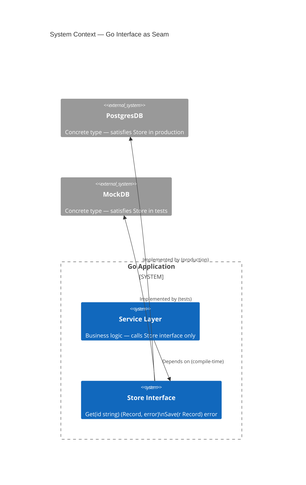
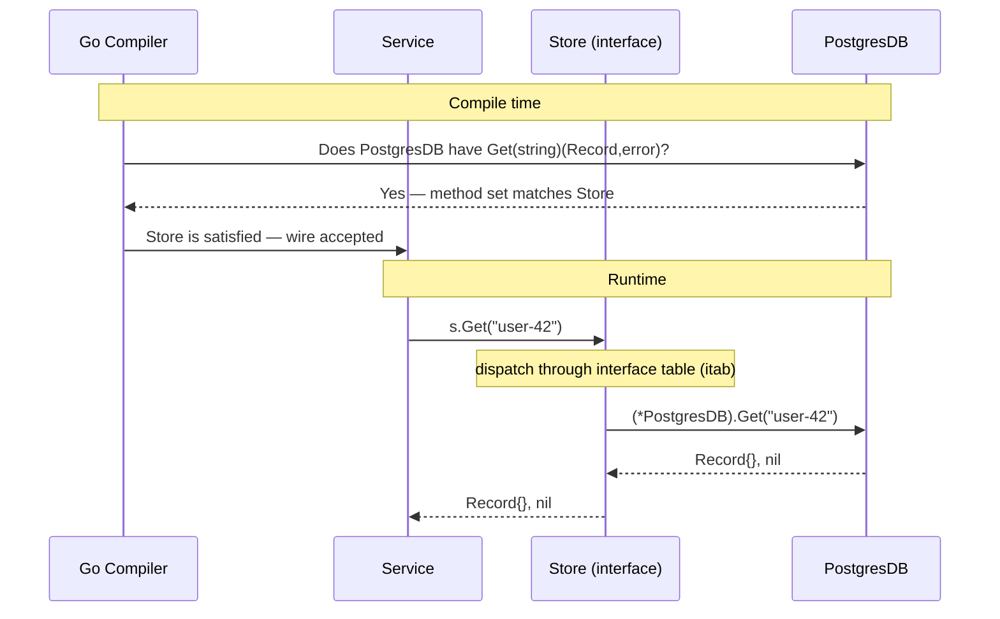

If you come from Java or C#, your instinct is to design big interfaces and have types implement them. Go inverts this completely — and that inversion is the point.

## The problem

Most languages treat interfaces as contracts you declare up front. You define `interface IUserRepository` with twelve methods, then every type that wants to be a repository must explicitly implement all twelve. The coupling is baked in at definition time, not at use time.

This creates two problems. First, you end up passing around fat abstractions that expose more surface area than any single caller needs. Second, testing becomes a tax: mocking `IUserRepository` means implementing all twelve methods, even if the function under test only calls one.

Go's interface system was designed around a different assumption: the caller knows what it needs, not the provider.

## What interfaces are in Go

An interface in Go is a set of method signatures. Any type that implements those methods satisfies the interface — no declaration, no `implements` keyword, no registration.

```go
type Stringer interface {
    String() string
}
```

Any type with a `String() string` method is automatically a `Stringer`. The type doesn't need to know `Stringer` exists. This is **structural typing**, sometimes called duck typing with compile-time verification.

The mental model: interfaces describe behavior, not identity. You don't say "this type is a Store" — you say "this type can do what Store requires." The distinction matters because the same type can satisfy dozens of interfaces simultaneously without knowing about any of them.

## Diagrams

### System context — interface as seam



The `Store` interface sits at the boundary between the service layer and the database layer. In production, `PostgresDB` is wired in. In tests, `MockDB` replaces it — with zero changes to the service.

### Compile-time vs runtime dispatch



At compile time the compiler verifies that the concrete type's method set is a superset of the interface. At runtime, method calls dispatch through an internal table (the `itab`) — a pointer pair: one to the type, one to the method implementation. The caller never references the concrete type directly.

## Accept interfaces, return structs

This single rule — if you follow nothing else — will make your Go code significantly easier to test and extend.

```go
// Bad: accepting a concrete type locks the caller to one implementation
func Process(db *PostgresDB) error { ... }

// Good: accepting an interface — any Store works
type Store interface {
    Get(id string) (Record, error)
    Save(r Record) error
}

func Process(s Store) error { ... }
```

The interface lives at the point of use, not at the point of definition. That's the inversion.

Returning structs (not interfaces) from constructors and factory functions preserves the concrete type's full method set for the caller, while still allowing that concrete type to be assigned to an interface variable later:

```go
// Good: return the concrete type
func NewPostgresDB(dsn string) *PostgresDB { ... }

// The caller can assign to an interface if it needs to
var s Store = NewPostgresDB(dsn)
```

If you return an interface from a constructor, you hide information the caller might need and make it harder to extend the type later without breaking the interface.

## Implicit satisfaction and composition

### No `implements` keyword

Go's satisfaction is structural. This has a practical consequence: you can satisfy interfaces defined in packages you don't control, without editing those packages.

```go
// From the standard library — you don't control this
type Reader interface {
    Read(p []byte) (n int, err error)
}

// Your type — in your package
type FileBuffer struct { ... }

func (fb *FileBuffer) Read(p []byte) (int, error) { ... }

// FileBuffer is now an io.Reader — no annotation required
var r io.Reader = &FileBuffer{}
```

This is how the standard library achieves its composability. `os.File`, `bytes.Buffer`, `strings.Reader`, `net.Conn` — none of them explicitly declare that they implement `io.Reader`. They just have the right method.

### Interface composition

Interfaces can embed other interfaces. The canonical example from the standard library:

```go
type Reader interface {
    Read(p []byte) (n int, err error)
}

type Writer interface {
    Write(p []byte) (n int, err error)
}

// ReadWriter requires both Read and Write
type ReadWriter interface {
    Reader
    Writer
}
```

This lets you compose precise requirements. A function that needs to both read and write accepts `io.ReadWriter`. A function that only needs to read accepts `io.Reader`. No single massive interface required.

## The one-method interface

The standard library's most influential design pattern is the one-method interface. Look at the core ones:

```go
// io package
type Reader interface { Read(p []byte) (n int, err error) }
type Writer interface { Write(p []byte) (n int, err error) }
type Closer interface { Close() error }

// fmt package
type Stringer interface { String() string }

// error built-in
type error interface { Error() string }
```

Each captures exactly one behavior. The power comes from what this unlocks: any type that does the thing becomes the thing. `*os.File`, `*bytes.Buffer`, `*net.TCPConn` are all `io.Reader`s. Functions that accept `io.Reader` work with files, buffers, network connections, test strings — without modification.

The one-method interface is the reason `io.Copy` exists and is useful:

```go
func Copy(dst Writer, src Reader) (written int64, err error)
```

It copies any reader to any writer. Two methods, zero concrete types, infinite composability.

When designing your own interfaces, the question to ask is: what is the smallest behavior I need to depend on? If the answer is one method, make a one-method interface.

## The empty interface and when not to use it

`any` (the alias for `interface{}`) represents a type that has no methods — which means every type satisfies it:

```go
func PrintAnything(v any) {
    fmt.Println(v)
}
```

The problem: you've opted out of the type system. The compiler can no longer catch misuse. Every consumer needs a type assertion or a type switch to do anything useful with the value:

```go
func process(v any) {
    switch x := v.(type) {
    case string:
        // handle string
    case int:
        // handle int
    default:
        // hope for the best
    }
}
```

This is fine when the heterogeneity is genuine — JSON deserialization, generic containers before generics existed, `context.WithValue`. But using `any` as a shortcut for "I don't want to think about the type" is a debt that compounds quickly in large codebases.

With Go 1.18+ generics available, most cases that previously needed `any` now have better options:

```go
// Before generics: forced to use any
func Map(slice []any, fn func(any) any) []any { ... }

// With generics: type-safe
func Map[T, U any](slice []T, fn func(T) U) []U { ... }
```

Reserve `any` for truly heterogeneous values. Prefer narrow interfaces or generics for everything else.

## Testing benefit: swap real DB for mock

This is where the "accept interfaces" rule pays off most directly. Given:

```go
type Store interface {
    Get(id string) (Record, error)
    Save(r Record) error
}

func Process(s Store) error {
    r, err := s.Get("key")
    if err != nil {
        return err
    }
    // ... business logic
    return s.Save(r)
}
```

The test writes a mock that satisfies `Store` — no framework, no code generation, no reflection:

```go
type mockStore struct {
    records map[string]Record
    saveErr error
}

func (m *mockStore) Get(id string) (Record, error) {
    r, ok := m.records[id]
    if !ok {
        return Record{}, fmt.Errorf("not found: %s", id)
    }
    return r, nil
}

func (m *mockStore) Save(r Record) error {
    return m.saveErr
}

func TestProcess_SaveError(t *testing.T) {
    s := &mockStore{
        records: map[string]Record{"key": {ID: "key", Value: "data"}},
        saveErr: errors.New("disk full"),
    }
    if err := Process(s); err == nil {
        t.Fatal("expected error, got nil")
    }
}
```

The mock is ten lines. It tests exactly the behavior of `Process` without touching a database. Add a new test case by adding a new `mockStore` literal.

This is the practical payoff of small interfaces: the mock is never larger than the interface. A three-method interface produces a three-method mock. A twelve-method interface produces a twelve-method mock — and you start reaching for `testify/mock` and code generators, which is a sign the interface was too large.

## Where it goes from here

Go generics (introduced in 1.18) changed the calculus for some interface use cases. Type parameters can now express constraints — "this function accepts any type that has a `Less` method" — without requiring an interface variable at runtime. The two features are complementary, not competing.

The direction in the Go ecosystem is toward even smaller, more composable interfaces. `io/fs`, introduced in Go 1.16, defined a minimal filesystem abstraction (`fs.FS`) with a single `Open` method — and then layered optional interfaces (`fs.ReadDirFS`, `fs.StatFS`) that implementations could choose to satisfy. This "core interface + optional extensions" pattern is increasingly common in well-designed Go packages.

If there is one durable principle in the Go interface story, it is this: depend on what you use, nothing more. The smaller the interface, the more types can satisfy it, the more your code composes, and the easier your tests become.

---

## Further reading

- [Effective Go: Interfaces](https://go.dev/doc/effective_go#interfaces) — Go team's canonical guidance on interface design
- [The Laws of Reflection](https://go.dev/blog/laws-of-reflection) — deep dive into how Go's type system and interfaces interact at runtime
- [io package documentation](https://pkg.go.dev/io) — the standard library's canonical small-interface examples
- [Uber Go Style Guide: Interfaces](https://github.com/uber-go/guide#interfaces) — practical, opinionated rules from a large Go codebase
- [SOLID Go Design](https://dave.cheney.net/2016/08/20/solid-go-design) — Dave Cheney on applying SOLID principles through Go interfaces

---

## About the author

**Ivens Signorini** is a Senior Backend Engineer focused on distributed systems, AI infrastructure, and high-performance APIs. He works primarily in Go and TypeScript, building systems that run at scale. His technical interests include protocol design, concurrency patterns, and the architecture of AI-native applications. He writes at [signorini.cloud](https://signorini.cloud).
