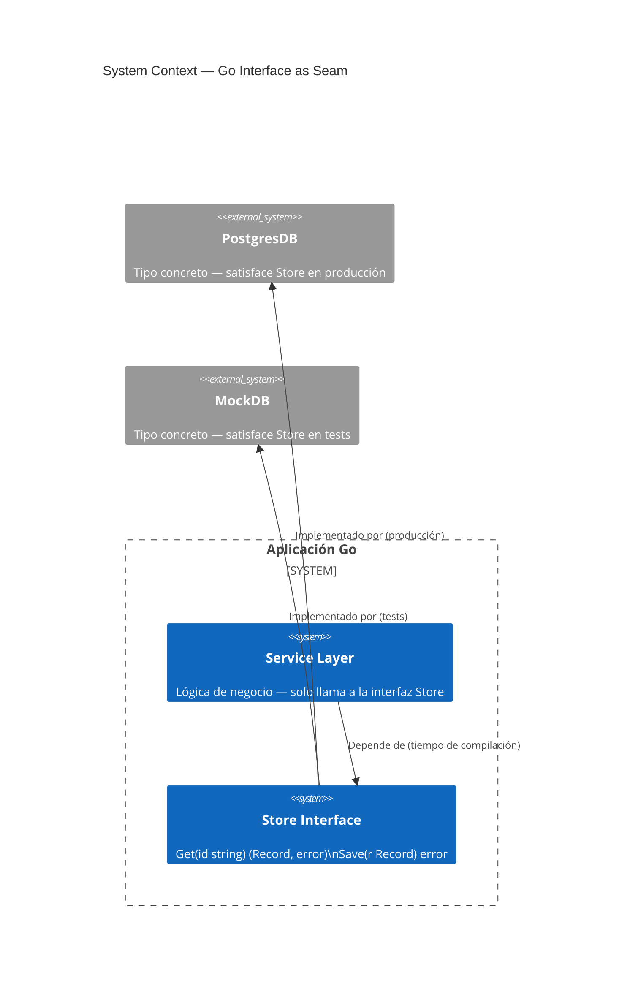
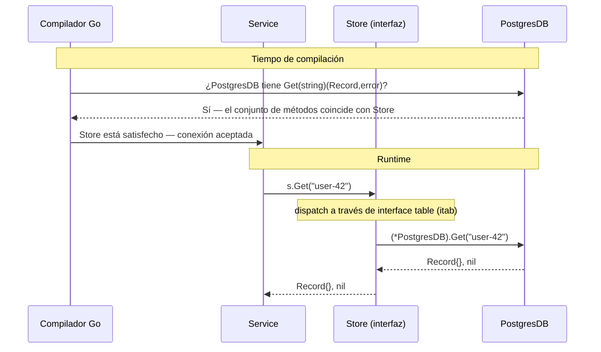

Si vienes de Java o C#, el instinto es diseñar interfaces grandes y hacer que los tipos las implementen. Go invierte esto por completo — y esa inversión es el punto central.

## El problema

La mayoría de los lenguajes tratan las interfaces como contratos que se declaran de antemano. Defines `interface IUserRepository` con doce métodos, y cada tipo que quiera ser un repositorio debe implementarlos explícitamente todos. El acoplamiento está incorporado en el momento de la definición, no en el momento del uso.

Esto crea dos problemas. Primero, terminas pasando abstracciones pesadas que exponen más superficie de la que cualquier llamador individual necesita. Segundo, el testing se convierte en un costo: hacer el mock de `IUserRepository` significa implementar los doce métodos, incluso si la función bajo prueba solo llama a uno.

El sistema de interfaces de Go fue diseñado alrededor de una suposición diferente: el llamador sabe lo que necesita, no el proveedor.

## Qué son las interfaces en Go

Una interfaz en Go es un conjunto de firmas de métodos. Cualquier tipo que implemente esos métodos satisface la interfaz — sin declaración, sin la palabra clave `implements`, sin registro.

```go
type Stringer interface {
    String() string
}
```

Cualquier tipo con un método `String() string` es automáticamente un `Stringer`. El tipo no necesita saber que `Stringer` existe. Esto es **tipado estructural**, a veces llamado duck typing con verificación en tiempo de compilación.

El modelo mental: las interfaces describen comportamiento, no identidad. No dices "este tipo es un Store" — dices "este tipo puede hacer lo que Store requiere." La distinción importa porque el mismo tipo puede satisfacer decenas de interfaces simultáneamente sin saber nada de ninguna de ellas.

## Diagramas

### Contexto de sistema — la interfaz como límite



La interfaz `Store` se ubica en el límite entre la capa de servicio y la capa de base de datos. En producción se usa `PostgresDB`. En tests la reemplaza `MockDB` — sin ningún cambio al servicio.

### Tiempo de compilación vs dispatch en runtime



En tiempo de compilación el compilador verifica que el conjunto de métodos del tipo concreto sea un superconjunto de la interfaz. En runtime, las llamadas a métodos se despachan a través de una tabla interna (el `itab`) — un par de punteros: uno al tipo, uno a la implementación del método. El llamador nunca referencia directamente el tipo concreto.

## Acepta interfaces, devuelve structs

Esta única regla — si no sigues nada más — hará que tu código Go sea significativamente más fácil de testear y extender.

```go
// Mal: aceptar un tipo concreto vincula al llamador a una sola implementación
func Process(db *PostgresDB) error { ... }

// Bien: aceptar una interfaz — cualquier Store funciona
type Store interface {
    Get(id string) (Record, error)
    Save(r Record) error
}

func Process(s Store) error { ... }
```

La interfaz vive en el punto de uso, no en el punto de definición. Esa es la inversión.

Devolver structs (no interfaces) desde constructores y factory functions preserva el conjunto completo de métodos del tipo concreto para el llamador, permitiendo aún que ese tipo concreto sea asignado a una variable de interfaz más adelante:

```go
// Bien: devuelve el tipo concreto
func NewPostgresDB(dsn string) *PostgresDB { ... }

// El llamador puede asignar a una interfaz si lo necesita
var s Store = NewPostgresDB(dsn)
```

Si devuelves una interfaz desde un constructor, ocultas información que el llamador podría necesitar y dificultas extender el tipo más tarde sin romper la interfaz.

## Satisfacción implícita y composición

### Sin la palabra clave `implements`

La satisfacción en Go es estructural. Esto tiene una consecuencia práctica: puedes satisfacer interfaces definidas en paquetes que no controlas, sin editar esos paquetes.

```go
// De la biblioteca estándar — no controlas esto
type Reader interface {
    Read(p []byte) (n int, err error)
}

// Tu tipo — en tu paquete
type FileBuffer struct { ... }

func (fb *FileBuffer) Read(p []byte) (int, error) { ... }

// FileBuffer es ahora un io.Reader — sin anotación requerida
var r io.Reader = &FileBuffer{}
```

Así es como la biblioteca estándar logra su componibilidad. `os.File`, `bytes.Buffer`, `strings.Reader`, `net.Conn` — ninguno declara explícitamente que implementa `io.Reader`. Simplemente tienen el método correcto.

### Composición de interfaces

Las interfaces pueden embeber otras interfaces. El ejemplo canónico de la biblioteca estándar:

```go
type Reader interface {
    Read(p []byte) (n int, err error)
}

type Writer interface {
    Write(p []byte) (n int, err error)
}

// ReadWriter requiere tanto Read como Write
type ReadWriter interface {
    Reader
    Writer
}
```

Esto permite componer requisitos precisos. Una función que necesita leer y escribir acepta `io.ReadWriter`. Una función que solo necesita leer acepta `io.Reader`. No se requiere ninguna interfaz masiva.

## La interfaz de un solo método

El patrón de diseño más influyente de la biblioteca estándar es la interfaz de un solo método. Las principales:

```go
// paquete io
type Reader interface { Read(p []byte) (n int, err error) }
type Writer interface { Write(p []byte) (n int, err error) }
type Closer interface { Close() error }

// paquete fmt
type Stringer interface { String() string }

// built-in error
type error interface { Error() string }
```

Cada una captura exactamente un comportamiento. El poder viene de lo que esto desbloquea: cualquier tipo que hace la cosa se convierte en la cosa. `*os.File`, `*bytes.Buffer`, `*net.TCPConn` son todos `io.Reader`. Las funciones que aceptan `io.Reader` funcionan con archivos, buffers, conexiones de red, strings de prueba — sin modificación.

La interfaz de un solo método es la razón por la que `io.Copy` existe y es útil:

```go
func Copy(dst Writer, src Reader) (written int64, err error)
```

Copia cualquier reader en cualquier writer. Dos métodos, cero tipos concretos, componibilidad infinita.

Cuando diseñes tus propias interfaces, la pregunta a hacerse es: ¿cuál es el comportamiento mínimo del que necesito depender? Si la respuesta es un método, crea una interfaz de un solo método.

## La interfaz vacía y cuándo no usarla

`any` (el alias para `interface{}`) representa un tipo que no tiene métodos — lo que significa que todo tipo la satisface:

```go
func PrintAnything(v any) {
    fmt.Println(v)
}
```

El problema: has optado por salir del sistema de tipos. El compilador ya no puede detectar usos incorrectos. Cada consumidor necesita una type assertion o un type switch para hacer algo útil con el valor:

```go
func process(v any) {
    switch x := v.(type) {
    case string:
        // manejar string
    case int:
        // manejar int
    default:
        // esperar lo mejor
    }
}
```

Esto está bien cuando la heterogeneidad es genuina — deserialización JSON, contenedores genéricos antes de que existieran los generics, `context.WithValue`. Pero usar `any` como atajo para "no quiero pensar en el tipo" es una deuda que crece rápidamente en codebases grandes.

Con los generics de Go 1.18+ disponibles, la mayoría de los casos que anteriormente necesitaban `any` ahora tienen mejores opciones:

```go
// Antes de los generics: obligado a usar any
func Map(slice []any, fn func(any) any) []any { ... }

// Con generics: type-safe
func Map[T, U any](slice []T, fn func(T) U) []U { ... }
```

Reserva `any` para valores genuinamente heterogéneos. Prefiere interfaces estrechas o generics para todo lo demás.

## Beneficio para el testing: reemplazar la BD real con un mock

Aquí es donde la regla "acepta interfaces" paga más directamente. Dado:

```go
type Store interface {
    Get(id string) (Record, error)
    Save(r Record) error
}

func Process(s Store) error {
    r, err := s.Get("key")
    if err != nil {
        return err
    }
    // ... business logic
    return s.Save(r)
}
```

El test escribe un mock que satisface `Store` — sin framework, sin generación de código, sin reflection:

```go
type mockStore struct {
    records map[string]Record
    saveErr error
}

func (m *mockStore) Get(id string) (Record, error) {
    r, ok := m.records[id]
    if !ok {
        return Record{}, fmt.Errorf("not found: %s", id)
    }
    return r, nil
}

func (m *mockStore) Save(r Record) error {
    return m.saveErr
}

func TestProcess_SaveError(t *testing.T) {
    s := &mockStore{
        records: map[string]Record{"key": {ID: "key", Value: "data"}},
        saveErr: errors.New("disk full"),
    }
    if err := Process(s); err == nil {
        t.Fatal("expected error, got nil")
    }
}
```

El mock tiene diez líneas. Prueba exactamente el comportamiento de `Process` sin tocar una base de datos. Añade un nuevo caso de prueba añadiendo un nuevo literal `mockStore`.

Este es el beneficio práctico de las interfaces pequeñas: el mock nunca es más grande que la interfaz. Una interfaz de tres métodos produce un mock de tres métodos. Una interfaz de doce métodos produce un mock de doce métodos — y empiezas a buscar `testify/mock` y generadores de código, lo cual es una señal de que la interfaz era demasiado grande.

## Hacia dónde va esto

Los generics de Go (introducidos en 1.18) cambiaron el cálculo para algunos casos de uso de interfaces. Los parámetros de tipo ahora pueden expresar restricciones — "esta función acepta cualquier tipo que tenga un método `Less`" — sin requerir una variable de interfaz en runtime. Las dos características son complementarias, no compiten entre sí.

La dirección en el ecosistema Go es hacia interfaces aún más pequeñas y componibles. `io/fs`, introducido en Go 1.16, definió una abstracción mínima del sistema de archivos (`fs.FS`) con un único método `Open` — y luego agregó interfaces opcionales (`fs.ReadDirFS`, `fs.StatFS`) que las implementaciones podían elegir satisfacer. Este patrón de "interfaz core + extensiones opcionales" es cada vez más común en los paquetes Go bien diseñados.

Si hay un principio duradero en la historia de las interfaces de Go, es este: depende de lo que usas, nada más. Cuanto más pequeña es la interfaz, más tipos pueden satisfacerla, más se compone tu código y más fáciles se vuelven tus tests.

---

## Lecturas adicionales

- [Effective Go: Interfaces](https://go.dev/doc/effective_go#interfaces) — guía canónica del equipo Go sobre diseño de interfaces
- [The Laws of Reflection](https://go.dev/blog/laws-of-reflection) — análisis profundo de cómo el sistema de tipos de Go y las interfaces interactúan en runtime
- [Documentación del paquete io](https://pkg.go.dev/io) — ejemplos canónicos de interfaces pequeñas en la biblioteca estándar
- [Uber Go Style Guide: Interfaces](https://github.com/uber-go/guide#interfaces) — reglas prácticas y con opinión de una codebase Go grande
- [SOLID Go Design](https://dave.cheney.net/2016/08/20/solid-go-design) — Dave Cheney sobre aplicar los principios SOLID a través de las interfaces de Go

---

## Sobre el autor

**Ivens Signorini** es un Senior Backend Engineer especializado en sistemas distribuidos, infraestructura de IA y APIs de alto rendimiento. Trabaja principalmente en Go y TypeScript, construyendo sistemas que operan a escala. Sus intereses técnicos incluyen el diseño de protocolos, patrones de concurrencia y la arquitectura de aplicaciones nativas de IA. Escribe en [signorini.cloud](https://signorini.cloud).
