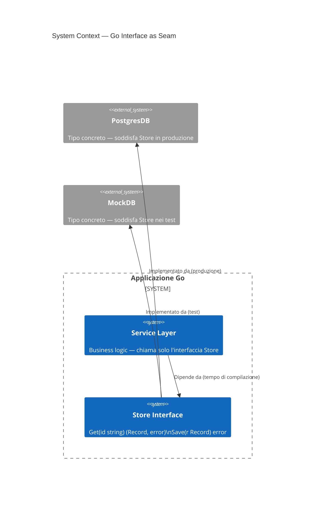
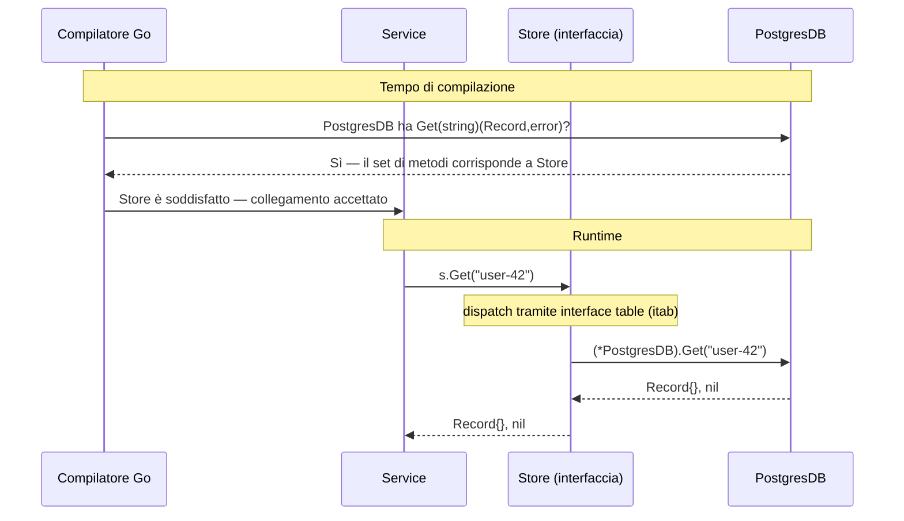

Se arrivi da Java o C#, l'istinto è quello di progettare interfacce grandi e far implementare i tipi su di esse. Go inverte completamente questa logica — e questa inversione è il punto centrale.

## Il problema

La maggior parte dei linguaggi tratta le interfacce come contratti dichiarati in anticipo. Si definisce `interface IUserRepository` con dodici metodi, e ogni tipo che vuole essere un repository deve implementarli esplicitamente tutti e dodici. L'accoppiamento è incorporato al momento della definizione, non al momento dell'uso.

Questo crea due problemi. Primo, si finisce per passare astrazioni pesanti che espongono più superficie di quanto qualsiasi chiamante singolo abbia bisogno. Secondo, il testing diventa un costo: fare il mock di `IUserRepository` significa implementare tutti e dodici i metodi, anche se la funzione sotto test ne chiama solo uno.

Il sistema di interfacce di Go è stato progettato attorno a un'assunzione diversa: è il chiamante a sapere di cosa ha bisogno, non il fornitore.

## Cosa sono le interfacce in Go

Un'interfaccia in Go è un insieme di firme di metodi. Qualsiasi tipo che implementa quei metodi soddisfa l'interfaccia — nessuna dichiarazione, nessuna parola chiave `implements`, nessuna registrazione.

```go
type Stringer interface {
    String() string
}
```

Qualsiasi tipo con un metodo `String() string` è automaticamente uno `Stringer`. Il tipo non ha bisogno di sapere che `Stringer` esiste. Questo è il **typing strutturale**, a volte chiamato duck typing con verifica a tempo di compilazione.

Il modello mentale: le interfacce descrivono il comportamento, non l'identità. Non si dice "questo tipo è uno Store" — si dice "questo tipo può fare ciò che Store richiede." La distinzione è importante perché lo stesso tipo può soddisfare decine di interfacce simultaneamente senza sapere nulla di nessuna di esse.

## Diagrammi

### Contesto di sistema — l'interfaccia come confine



L'interfaccia `Store` si trova al confine tra il layer di servizio e il layer del database. In produzione viene usata `PostgresDB`. Nei test la sostituisce `MockDB` — senza alcuna modifica al servizio.

### Tempo di compilazione vs dispatch a runtime



Al tempo di compilazione il compilatore verifica che il set di metodi del tipo concreto sia un sovrainsieme dell'interfaccia. A runtime, le chiamate ai metodi vengono dispatchate tramite una tabella interna (l'`itab`) — una coppia di puntatori: uno al tipo, uno all'implementazione del metodo. Il chiamante non fa mai riferimento direttamente al tipo concreto.

## Accetta interfacce, restituisci struct

Questa singola regola — se non segui nient'altro — renderà il tuo codice Go significativamente più facile da testare ed estendere.

```go
// Male: accettare un tipo concreto vincola il chiamante a una sola implementazione
func Process(db *PostgresDB) error { ... }

// Bene: accettare un'interfaccia — qualsiasi Store funziona
type Store interface {
    Get(id string) (Record, error)
    Save(r Record) error
}

func Process(s Store) error { ... }
```

L'interfaccia vive al punto di utilizzo, non al punto di definizione. Questa è l'inversione.

Restituire struct (non interfacce) da costruttori e factory function preserva il set completo di metodi del tipo concreto per il chiamante, permettendo comunque che quel tipo concreto venga assegnato a una variabile interfaccia in seguito:

```go
// Bene: restituisci il tipo concreto
func NewPostgresDB(dsn string) *PostgresDB { ... }

// Il chiamante può assegnare a un'interfaccia se necessario
var s Store = NewPostgresDB(dsn)
```

Se restituisci un'interfaccia da un costruttore, nascondi informazioni che il chiamante potrebbe aver bisogno e rendi più difficile estendere il tipo in seguito senza rompere l'interfaccia.

## Soddisfazione implicita e composizione

### Nessuna parola chiave `implements`

La soddisfazione in Go è strutturale. Questo ha una conseguenza pratica: puoi soddisfare interfacce definite in pacchetti che non controlli, senza modificare quei pacchetti.

```go
// Dalla libreria standard — non controlli questo
type Reader interface {
    Read(p []byte) (n int, err error)
}

// Il tuo tipo — nel tuo pacchetto
type FileBuffer struct { ... }

func (fb *FileBuffer) Read(p []byte) (int, error) { ... }

// FileBuffer è ora un io.Reader — nessuna annotazione richiesta
var r io.Reader = &FileBuffer{}
```

È così che la libreria standard raggiunge la sua componibilità. `os.File`, `bytes.Buffer`, `strings.Reader`, `net.Conn` — nessuno di essi dichiara esplicitamente di implementare `io.Reader`. Hanno semplicemente il metodo giusto.

### Composizione di interfacce

Le interfacce possono incorporare altre interfacce. L'esempio canonico dalla libreria standard:

```go
type Reader interface {
    Read(p []byte) (n int, err error)
}

type Writer interface {
    Write(p []byte) (n int, err error)
}

// ReadWriter richiede sia Read che Write
type ReadWriter interface {
    Reader
    Writer
}
```

Questo consente di comporre requisiti precisi. Una funzione che ha bisogno di leggere e scrivere accetta `io.ReadWriter`. Una funzione che ha solo bisogno di leggere accetta `io.Reader`. Nessuna interfaccia massiccia richiesta.

## L'interfaccia con un solo metodo

Il pattern di design più influente della libreria standard è l'interfaccia con un solo metodo. Le principali:

```go
// pacchetto io
type Reader interface { Read(p []byte) (n int, err error) }
type Writer interface { Write(p []byte) (n int, err error) }
type Closer interface { Close() error }

// pacchetto fmt
type Stringer interface { String() string }

// built-in error
type error interface { Error() string }
```

Ognuna cattura esattamente un comportamento. Il potere viene da ciò che questo sblocca: qualsiasi tipo che fa la cosa diventa la cosa. `*os.File`, `*bytes.Buffer`, `*net.TCPConn` sono tutti `io.Reader`. Le funzioni che accettano `io.Reader` funzionano con file, buffer, connessioni di rete, stringhe di test — senza modifiche.

L'interfaccia con un solo metodo è la ragione per cui `io.Copy` esiste ed è utile:

```go
func Copy(dst Writer, src Reader) (written int64, err error)
```

Copia qualsiasi reader su qualsiasi writer. Due metodi, zero tipi concreti, componibilità infinita.

Quando si progettano le proprie interfacce, la domanda da porsi è: qual è il comportamento minimo da cui ho bisogno di dipendere? Se la risposta è un metodo, crea un'interfaccia con un solo metodo.

## L'interfaccia vuota e quando non usarla

`any` (l'alias per `interface{}`) rappresenta un tipo che non ha metodi — il che significa che ogni tipo la soddisfa:

```go
func PrintAnything(v any) {
    fmt.Println(v)
}
```

Il problema: hai rinunciato al sistema di tipi. Il compilatore non può più rilevare usi errati. Ogni consumatore ha bisogno di un'asserzione di tipo o di un type switch per fare qualcosa di utile con il valore:

```go
func process(v any) {
    switch x := v.(type) {
    case string:
        // gestisci string
    case int:
        // gestisci int
    default:
        // sperare per il meglio
    }
}
```

Questo va bene quando l'eterogeneità è genuina — deserializzazione JSON, container generici prima che esistessero i generici, `context.WithValue`. Ma usare `any` come scorciatoia per "non voglio pensare al tipo" è un debito che cresce rapidamente nelle codebase grandi.

Con i generici di Go 1.18+ disponibili, la maggior parte dei casi che in precedenza richiedeva `any` ora ha opzioni migliori:

```go
// Prima dei generici: costretto a usare any
func Map(slice []any, fn func(any) any) []any { ... }

// Con i generici: type-safe
func Map[T, U any](slice []T, fn func(T) U) []U { ... }
```

Riserva `any` per valori genuinamente eterogenei. Preferisci interfacce strette o generici per tutto il resto.

## Beneficio per il testing: sostituire il DB reale con un mock

È qui che la regola "accetta interfacce" paga nel modo più diretto. Dato:

```go
type Store interface {
    Get(id string) (Record, error)
    Save(r Record) error
}

func Process(s Store) error {
    r, err := s.Get("key")
    if err != nil {
        return err
    }
    // ... business logic
    return s.Save(r)
}
```

Il test scrive un mock che soddisfa `Store` — nessun framework, nessuna generazione di codice, nessuna reflection:

```go
type mockStore struct {
    records map[string]Record
    saveErr error
}

func (m *mockStore) Get(id string) (Record, error) {
    r, ok := m.records[id]
    if !ok {
        return Record{}, fmt.Errorf("not found: %s", id)
    }
    return r, nil
}

func (m *mockStore) Save(r Record) error {
    return m.saveErr
}

func TestProcess_SaveError(t *testing.T) {
    s := &mockStore{
        records: map[string]Record{"key": {ID: "key", Value: "data"}},
        saveErr: errors.New("disk full"),
    }
    if err := Process(s); err == nil {
        t.Fatal("expected error, got nil")
    }
}
```

Il mock è di dieci righe. Testa esattamente il comportamento di `Process` senza toccare un database. Aggiungi un nuovo caso di test aggiungendo un nuovo letterale `mockStore`.

Questo è il payoff pratico delle interfacce piccole: il mock non è mai più grande dell'interfaccia. Un'interfaccia con tre metodi produce un mock con tre metodi. Un'interfaccia con dodici metodi produce un mock con dodici metodi — e si inizia a cercare `testify/mock` e generatori di codice, il che è un segnale che l'interfaccia era troppo grande.

## Dove va da qui

I generici di Go (introdotti nella 1.18) hanno cambiato il calcolo per alcuni casi d'uso delle interfacce. I parametri di tipo possono ora esprimere vincoli — "questa funzione accetta qualsiasi tipo che ha un metodo `Less`" — senza richiedere una variabile interfaccia a runtime. Le due caratteristiche sono complementari, non in competizione.

La direzione nell'ecosistema Go è verso interfacce ancora più piccole e componibili. `io/fs`, introdotto in Go 1.16, ha definito un'astrazione minimale del filesystem (`fs.FS`) con un singolo metodo `Open` — e poi ha aggiunto interfacce opzionali (`fs.ReadDirFS`, `fs.StatFS`) che le implementazioni potevano scegliere di soddisfare. Questo pattern "interfaccia core + estensioni opzionali" è sempre più comune nei pacchetti Go ben progettati.

Se c'è un principio duraturo nella storia delle interfacce Go, è questo: dipendi da ciò che usi, niente di più. Più piccola è l'interfaccia, più tipi possono soddisfarla, più il tuo codice si compone, e più i tuoi test diventano semplici.

---

## Ulteriori letture

- [Effective Go: Interfaces](https://go.dev/doc/effective_go#interfaces) — guida canonica del team Go sulla progettazione delle interfacce
- [The Laws of Reflection](https://go.dev/blog/laws-of-reflection) — approfondimento su come il sistema di tipi di Go e le interfacce interagiscono a runtime
- [Documentazione del pacchetto io](https://pkg.go.dev/io) — esempi canonici di interfacce piccole nella libreria standard
- [Uber Go Style Guide: Interfaces](https://github.com/uber-go/guide#interfaces) — regole pratiche e opinionated da una grande codebase Go
- [SOLID Go Design](https://dave.cheney.net/2016/08/20/solid-go-design) — Dave Cheney sull'applicazione dei principi SOLID tramite le interfacce Go

---

## Sull'autore

**Ivens Signorini** è un Senior Backend Engineer specializzato in sistemi distribuiti, infrastruttura AI e API ad alte prestazioni. Lavora principalmente in Go e TypeScript, costruendo sistemi che operano su larga scala. I suoi interessi tecnici includono il design dei protocolli, i pattern di concorrenza e l'architettura delle applicazioni AI-native. Scrive su [signorini.cloud](https://signorini.cloud).
