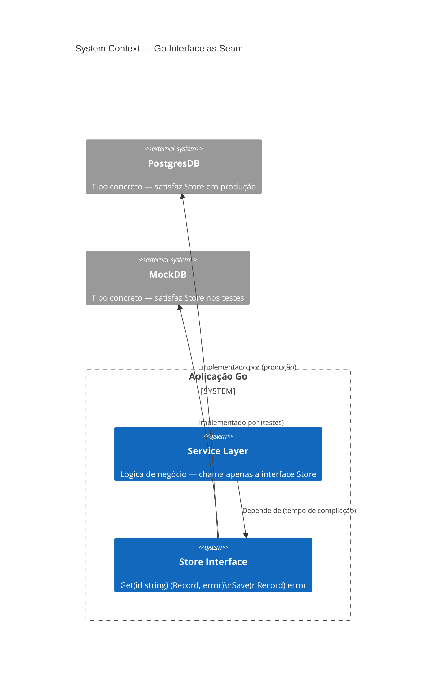
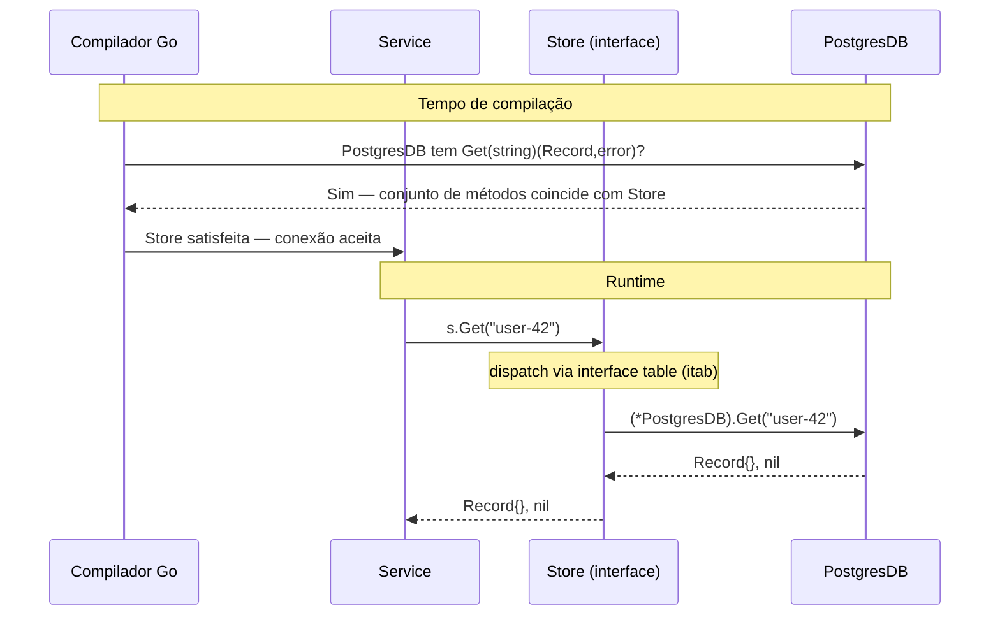

Se você vem de Java ou C#, o instinto é projetar interfaces grandes e fazer os tipos implementá-las. Go inverte isso completamente — e essa inversão é o ponto central.

## O problema

A maioria das linguagens trata interfaces como contratos declarados de antemão. Você define `interface IUserRepository` com doze métodos, e cada tipo que queira ser um repositório deve implementar todos explicitamente. O acoplamento está incorporado no momento da definição, não no momento do uso.

Isso cria dois problemas. Primeiro, você acaba passando abstrações pesadas que expõem mais superfície do que qualquer chamador individual precisa. Segundo, o testing vira um custo: fazer o mock de `IUserRepository` significa implementar todos os doze métodos, mesmo que a função sendo testada só chame um.

O sistema de interfaces do Go foi projetado com uma premissa diferente: o chamador sabe o que precisa, não o provedor.

## O que são interfaces em Go

Uma interface em Go é um conjunto de assinaturas de métodos. Qualquer tipo que implementar esses métodos satisfaz a interface — sem declaração, sem a palavra-chave `implements`, sem registro.

```go
type Stringer interface {
    String() string
}
```

Qualquer tipo com um método `String() string` é automaticamente um `Stringer`. O tipo não precisa saber que `Stringer` existe. Isso é **tipagem estrutural**, às vezes chamada de duck typing com verificação em tempo de compilação.

O modelo mental: interfaces descrevem comportamento, não identidade. Você não diz "este tipo é um Store" — você diz "este tipo pode fazer o que Store requer." A distinção importa porque o mesmo tipo pode satisfazer dezenas de interfaces simultaneamente sem saber nada de nenhuma delas.

## Diagramas

### Contexto de sistema — a interface como fronteira



A interface `Store` fica na fronteira entre a camada de serviço e a camada de banco de dados. Em produção, `PostgresDB` é conectada. Nos testes, `MockDB` a substitui — sem nenhuma alteração no serviço.

### Tempo de compilação vs dispatch em runtime



Em tempo de compilação o compilador verifica que o conjunto de métodos do tipo concreto é um superconjunto da interface. Em runtime, chamadas de método são despachadas através de uma tabela interna (o `itab`) — um par de ponteiros: um para o tipo, outro para a implementação do método. O chamador nunca referencia o tipo concreto diretamente.

## Aceite interfaces, retorne structs

Esta única regra — se você não seguir mais nada — tornará seu código Go significativamente mais fácil de testar e extender.

```go
// Ruim: aceitar um tipo concreto prende o chamador a uma única implementação
func Process(db *PostgresDB) error { ... }

// Bom: aceitar uma interface — qualquer Store funciona
type Store interface {
    Get(id string) (Record, error)
    Save(r Record) error
}

func Process(s Store) error { ... }
```

A interface vive no ponto de uso, não no ponto de definição. Essa é a inversão.

Retornar structs (não interfaces) de construtores e factory functions preserva o conjunto completo de métodos do tipo concreto para o chamador, permitindo ainda que esse tipo concreto seja atribuído a uma variável de interface posteriormente:

```go
// Bom: retorne o tipo concreto
func NewPostgresDB(dsn string) *PostgresDB { ... }

// O chamador pode atribuir a uma interface se precisar
var s Store = NewPostgresDB(dsn)
```

Se você retornar uma interface de um construtor, oculta informações que o chamador pode precisar e dificulta estender o tipo depois sem quebrar a interface.

## Satisfação implícita e composição

### Sem a palavra-chave `implements`

A satisfação no Go é estrutural. Isso tem uma consequência prática: você pode satisfazer interfaces definidas em pacotes que não controla, sem editar esses pacotes.

```go
// Da biblioteca padrão — você não controla isso
type Reader interface {
    Read(p []byte) (n int, err error)
}

// Seu tipo — no seu pacote
type FileBuffer struct { ... }

func (fb *FileBuffer) Read(p []byte) (int, error) { ... }

// FileBuffer agora é um io.Reader — sem anotação necessária
var r io.Reader = &FileBuffer{}
```

É assim que a biblioteca padrão consegue sua componibilidade. `os.File`, `bytes.Buffer`, `strings.Reader`, `net.Conn` — nenhum deles declara explicitamente que implementa `io.Reader`. Eles simplesmente têm o método correto.

### Composição de interfaces

Interfaces podem embedar outras interfaces. O exemplo canônico da biblioteca padrão:

```go
type Reader interface {
    Read(p []byte) (n int, err error)
}

type Writer interface {
    Write(p []byte) (n int, err error)
}

// ReadWriter requer tanto Read quanto Write
type ReadWriter interface {
    Reader
    Writer
}
```

Isso permite compor requisitos precisos. Uma função que precisa ler e escrever aceita `io.ReadWriter`. Uma função que só precisa ler aceita `io.Reader`. Nenhuma interface massiva necessária.

## A interface de um único método

O padrão de design mais influente da biblioteca padrão é a interface de um único método. As principais:

```go
// pacote io
type Reader interface { Read(p []byte) (n int, err error) }
type Writer interface { Write(p []byte) (n int, err error) }
type Closer interface { Close() error }

// pacote fmt
type Stringer interface { String() string }

// built-in error
type error interface { Error() string }
```

Cada uma captura exatamente um comportamento. O poder vem do que isso desbloqueia: qualquer tipo que faz a coisa se torna a coisa. `*os.File`, `*bytes.Buffer`, `*net.TCPConn` são todos `io.Reader`. Funções que aceitam `io.Reader` funcionam com arquivos, buffers, conexões de rede, strings de teste — sem modificação.

A interface de um único método é a razão pela qual `io.Copy` existe e é útil:

```go
func Copy(dst Writer, src Reader) (written int64, err error)
```

Copia qualquer reader para qualquer writer. Dois métodos, zero tipos concretos, componibilidade infinita.

Ao projetar suas próprias interfaces, a pergunta a fazer é: qual é o comportamento mínimo do qual preciso depender? Se a resposta é um método, crie uma interface de um único método.

## A interface vazia e quando não usá-la

`any` (o alias para `interface{}`) representa um tipo que não tem métodos — o que significa que todo tipo a satisfaz:

```go
func PrintAnything(v any) {
    fmt.Println(v)
}
```

O problema: você optou por sair do sistema de tipos. O compilador não pode mais detectar usos incorretos. Cada consumidor precisa de uma type assertion ou um type switch para fazer algo útil com o valor:

```go
func process(v any) {
    switch x := v.(type) {
    case string:
        // tratar string
    case int:
        // tratar int
    default:
        // torcer para o melhor
    }
}
```

Isso é aceitável quando a heterogeneidade é genuína — deserialização JSON, containers genéricos antes de generics existirem, `context.WithValue`. Mas usar `any` como atalho para "não quero pensar no tipo" é uma dívida que cresce rapidamente em codebases grandes.

Com os generics do Go 1.18+ disponíveis, a maioria dos casos que anteriormente precisavam de `any` agora têm opções melhores:

```go
// Antes dos generics: obrigado a usar any
func Map(slice []any, fn func(any) any) []any { ... }

// Com generics: type-safe
func Map[T, U any](slice []T, fn func(T) U) []U { ... }
```

Reserve `any` para valores genuinamente heterogêneos. Prefira interfaces estreitas ou generics para todo o resto.

## Benefício para o testing: trocar o BD real por um mock

É aqui que a regra "aceite interfaces" paga de forma mais direta. Dado:

```go
type Store interface {
    Get(id string) (Record, error)
    Save(r Record) error
}

func Process(s Store) error {
    r, err := s.Get("key")
    if err != nil {
        return err
    }
    // ... business logic
    return s.Save(r)
}
```

O teste escreve um mock que satisfaz `Store` — sem framework, sem geração de código, sem reflection:

```go
type mockStore struct {
    records map[string]Record
    saveErr error
}

func (m *mockStore) Get(id string) (Record, error) {
    r, ok := m.records[id]
    if !ok {
        return Record{}, fmt.Errorf("not found: %s", id)
    }
    return r, nil
}

func (m *mockStore) Save(r Record) error {
    return m.saveErr
}

func TestProcess_SaveError(t *testing.T) {
    s := &mockStore{
        records: map[string]Record{"key": {ID: "key", Value: "data"}},
        saveErr: errors.New("disk full"),
    }
    if err := Process(s); err == nil {
        t.Fatal("expected error, got nil")
    }
}
```

O mock tem dez linhas. Testa exatamente o comportamento de `Process` sem tocar em um banco de dados. Adicione um novo caso de teste adicionando um novo literal `mockStore`.

Este é o benefício prático de interfaces pequenas: o mock nunca é maior que a interface. Uma interface de três métodos produz um mock de três métodos. Uma interface de doze métodos produz um mock de doze métodos — e você começa a buscar `testify/mock` e geradores de código, o que é um sinal de que a interface era grande demais.

## Para onde vai daqui

Os generics do Go (introduzidos na 1.18) mudaram o cálculo para alguns casos de uso de interfaces. Parâmetros de tipo agora podem expressar restrições — "esta função aceita qualquer tipo que tenha um método `Less`" — sem exigir uma variável de interface em runtime. As duas funcionalidades são complementares, não concorrentes.

A direção no ecossistema Go é em direção a interfaces ainda menores e mais componíveis. `io/fs`, introduzido no Go 1.16, definiu uma abstração mínima de sistema de arquivos (`fs.FS`) com um único método `Open` — e então adicionou interfaces opcionais (`fs.ReadDirFS`, `fs.StatFS`) que as implementações podiam escolher satisfazer. Esse padrão de "interface core + extensões opcionais" é cada vez mais comum em pacotes Go bem projetados.

Se há um princípio duradouro na história das interfaces Go, é este: dependa do que você usa, nada mais. Quanto menor a interface, mais tipos podem satisfazê-la, mais seu código se compõe e mais fáceis se tornam seus testes.

---

## Leitura adicional

- [Effective Go: Interfaces](https://go.dev/doc/effective_go#interfaces) — guia canônico da equipe Go sobre design de interfaces
- [The Laws of Reflection](https://go.dev/blog/laws-of-reflection) — análise profunda de como o sistema de tipos do Go e as interfaces interagem em runtime
- [Documentação do pacote io](https://pkg.go.dev/io) — exemplos canônicos de interfaces pequenas na biblioteca padrão
- [Uber Go Style Guide: Interfaces](https://github.com/uber-go/guide#interfaces) — regras práticas e opinativas de uma grande codebase Go
- [SOLID Go Design](https://dave.cheney.net/2016/08/20/solid-go-design) — Dave Cheney sobre aplicar os princípios SOLID através das interfaces Go

---

## Sobre o autor

**Ivens Signorini** é um Engenheiro Backend Sênior com foco em sistemas distribuídos, infraestrutura de IA e APIs de alto desempenho. Trabalha principalmente em Go e TypeScript, construindo sistemas que operam em escala. Seus interesses técnicos incluem design de protocolos, padrões de concorrência e arquitetura de aplicações nativas de IA. Escreve em [signorini.cloud](https://signorini.cloud).
