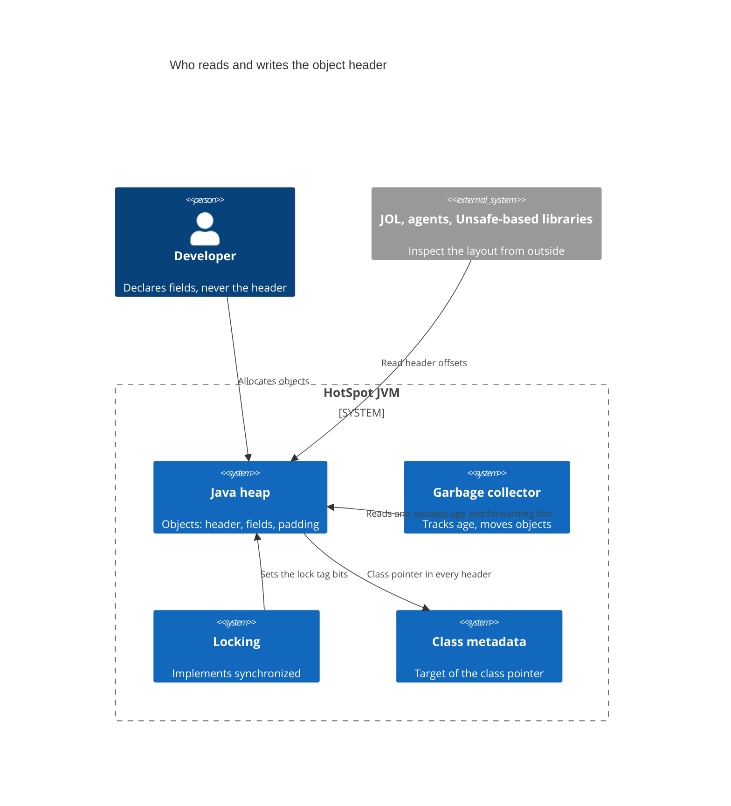
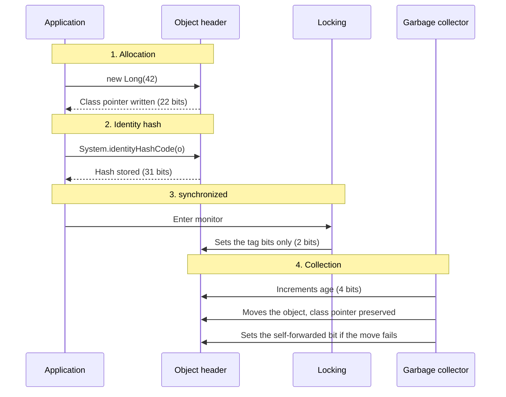
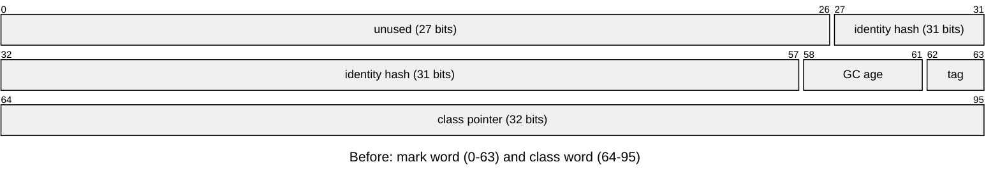
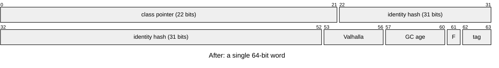

Java reached version 27 in September 2026, thirty years after JDK 1.0, and one of the most relevant changes in this release does not show up in any line of code: every object in the JVM now has, by default, an 8-byte header instead of a 12-byte one.

Two stories intersect here. One is the evolution of the language and the platform, release by release. The other is the object header: what it is, why it cost so much, and how Project Lilliput shrank it without breaking the JVM. Shrinking the header was only possible because, over several releases, the platform removed or rewrote old pieces that occupied those bits.

## The problem

Every object on the HotSpot heap starts with a header the programmer never declares, and up to Java 26 it took 12 bytes in the default 64-bit configuration. It is where the JVM keeps what it needs to know about the object, before the fields.

It sounds small, but Java objects are small. According to JEP 450, in many workloads the average object is 32 to 64 bytes, which means more than 20% of live data can be headers alone. On a 10 GB heap, that is about 2 GB spent before the first field.

There is also alignment: the JVM rounds each object's size up to a multiple of 8 bytes. A `new Object()` uses 12 bytes of header plus 4 of padding, for a total of 16 bytes for an object with no fields at all.

## What the object header is

The traditional header has two parts:

- **Mark word (64 bits):** holds the identity hash (31 bits, the value of `System.identityHashCode`), the object's age for the garbage collector (4 bits) and the lock-state bits used by `synchronized` (2 bits). The rest was unused.
- **Class word (32 or 64 bits):** the pointer to the class metadata. With compressed class pointers, which are the default, it takes 32 bits; without compression, 64.

That adds up to 96 bits (12 bytes) in the common case and 128 bits (16 bytes) without compression. Arrays add another 4 bytes for the length.

The mental model: the header is the JVM's own bookkeeping, shared by three subsystems that each claim a few bits. The garbage collector, the locking code and the class metadata all read and write the same words, which is why changing the layout means changing all three.

### System context



### One object's life in the header



## Compact Object Headers: everything in 64 bits

Project Lilliput's idea is simple to state: move the class pointer into the mark word, using the bits that were sitting idle, and drop the class word. The header falls from 12 to 8 bytes.

To fit, the compressed class pointer shrank from 32 to 22 bits, which still allows about 4 million loaded classes. The identity hash kept its 31 bits, and 4 bits were reserved for Project Valhalla.

Before, 96 bits (12 bytes): a 64-bit mark word followed by a 32-bit class word.



After, 64 bits (8 bytes): the class pointer lives inside the mark word.



*Simplified header layout in 64-bit HotSpot. `tag` is the 2-bit lock tag, `F` the 1-bit self-forwarded flag, `Valhalla` the 4 bits reserved for Project Valhalla.*

The 27 unused bits of the old mark word absorb the reduced class pointer, the 4 Valhalla bits and the self-forwarding bit; the class word disappears.

The hard part was that the old JVM overwrote the mark word in two situations, and now that would erase the object's class:

- **Locking:** the old `synchronized` scheme replaced the mark word with a pointer into the thread's stack. The solution was lightweight locking, which uses only the tag bits, with monitors kept in a separate table.
- **Garbage collection:** when moving an object, collectors wrote the new address over the header. Now a dedicated bit marks an object that could not be moved (self-forwarded), and compaction uses an encoding that preserves the class pointer. ZGC did not need to change, since it already uses separate tables.

Delivery came in three steps, one per JEP:

| JEP | Version | Status | How to use |
| --- | --- | --- | --- |
| [JEP 450](https://openjdk.org/jeps/450) | Java 24 | Experimental | `-XX:+UnlockExperimentalVMOptions -XX:+UseCompactObjectHeaders` |
| [JEP 519](https://openjdk.org/jeps/519) | Java 25 (LTS) | Product feature, off by default | `-XX:+UseCompactObjectHeaders` |
| [JEP 534](https://openjdk.org/jeps/534) | Java 27 | On by default | Nothing; to turn it off, `-XX:-UseCompactObjectHeaders` |

Between the experiment and the default, Oracle ran the full JDK test suite with the feature on, and Amazon deployed it in hundreds of production services, most of them with backports to JDK 17 and 21.

## The gain in practice

JEP 450 reports a typical reduction of 10% to 20% in live heap data, with no change to application code. Less memory per object also means more objects per cache line and less work for the collector.

The numbers published in JEPs 519 and 534:

- SPECjbb2015: 22% less heap and 8% less CPU time.
- In another setting of the same benchmark: 15% fewer garbage collections, with both G1 and Parallel.
- A highly parallel JSON parser benchmark: 10% less run time.

### Not every object shrinks

Because of 8-byte alignment, the gain depends on the size of the fields. The values below follow from header + fields + alignment arithmetic in the default 64-bit configuration; JOL shows the real layout on any given JVM.

| Object | 12-byte header | 8-byte header |
| --- | --- | --- |
| `new Object()` | 16 bytes | 8 bytes |
| `Long` | 24 bytes | 16 bytes |
| `Integer` | 16 bytes | 16 bytes |
| `String` (without its internal array) | 24 bytes | 24 bytes |
| Array header | 16 bytes | 12 bytes |

An `Integer` stays at 16 bytes because 8 of header plus 4 for the `int` make 12, which alignment rounds up to 16. An application's real gain is the average over all of its objects.

### How to measure

JOL (Java Object Layout), a tool from OpenJDK itself, shows the layout of any class. Use a recent version and compare with the feature on and off:

```bash
java -XX:+UseCompactObjectHeaders -jar jol-cli.jar internals java.lang.Long
java -XX:-UseCompactObjectHeaders -jar jol-cli.jar internals java.lang.Long
```

For the effect on the whole application, compare heap occupancy after a full GC and the collection frequency in the logs (`-Xlog:gc`) under the same load.

## Limitations and caveats

- **Class limit:** a 22-bit class pointer allows about 4 million classes. That is enough for practically any system, but anyone generating classes dynamically at scale should keep an eye on it.
- **Compressed class pointers are required:** the compact header depends on them.
- **Giant heaps:** outside ZGC, the encoding used during compaction addresses up to 8 TB of heap.
- **Code that assumes the layout:** libraries that use `sun.misc.Unsafe` with fixed offsets, or agents that read the header directly, need to be updated.
- **No spare bits:** the header is full. JEP 534 notes that, if new features need bits, the class pointer and the hash can shrink further, with techniques already prototyped in Lilliput.

On Java 25 the feature can be turned on today with one flag and measured. On 27 it is already on.

## History: thirty years of releases

### The origins (1996-2002): from 1.0 to 1.4

Java was born at Sun Microsystems with the promise of "write once, run anywhere": code compiled to bytecode and executed by a virtual machine. The early years were spent building the standard library and the JVM itself.

| Version | Released | What it brought |
| --- | --- | --- |
| JDK 1.0 | Jan 1996 | Language, JVM, applets, AWT |
| JDK 1.1 | Feb 1997 | Inner classes, JDBC, RMI, reflection, JavaBeans |
| J2SE 1.2 | Dec 1998 | Collections Framework, Swing, JIT compiler |
| J2SE 1.3 | May 2000 | HotSpot as the default JVM, JNDI, dynamic proxies |
| J2SE 1.4 | Feb 2002 | `assert`, NIO, regular expressions, logging API, exception chaining |

Two milestones from this period still matter today. The Collections Framework (1.2) made `List`, `Map` and `Set` the common vocabulary of all Java code. And HotSpot (1.3) is the same JVM whose object header is dissected above.

### The language matures (2004-2014): from 5 to 8

There were four releases in ten years, but two of them, 5 and 8, changed the language more than all the previous ones combined.

| Version | Released | What it brought |
| --- | --- | --- |
| Java 5 | Sep 2004 | Generics, annotations, enums, autoboxing, varargs, for-each, `java.util.concurrent` |
| Java 6 | Dec 2006 | Scripting API, compiler API, JVM performance gains |
| Java 7 | Jul 2011 | try-with-resources, diamond operator, `String` in `switch`, multi-catch, NIO.2, fork/join, `invokedynamic` |
| Java 8 | Mar 2014 | Lambdas, Streams, `java.time`, default methods in interfaces, `Optional`, end of PermGen |

Java 5 gave the language type safety in collections and a high-level concurrency library. Java 7 was the first under Oracle, which bought Sun in 2010, and the `invokedynamic` it introduced became the foundation of lambdas three years later.

Java 8 brought the functional style into everyday code:

```java
List<String> names = people.stream()
    .filter(p -> p.getAge() >= 18)
    .map(Person::getName)
    .sorted()
    .collect(Collectors.toList());
```

It became the longest-lived release in the platform's history, and many enterprise systems still run on it.

### The new cadence (2017-2021): from 9 to 17

Starting with Java 9 the platform began shipping a release every six months, in March and September. Large features arrive first as previews, gather feedback and only then are finalized. Some releases are LTS (long-term support): 11, 17, 21 and 25.

| Version | Released | What it brought |
| --- | --- | --- |
| Java 9 | Sep 2017 | Module system (JPMS), JShell, G1 as the default collector, compact strings |
| Java 10 | Mar 2018 | `var` for local variables |
| Java 11 (LTS) | Sep 2018 | New `HttpClient`, direct launch of a `.java` file, experimental ZGC, removal of the Java EE and CORBA modules |
| Java 12 | Mar 2019 | `switch` expressions (preview), experimental Shenandoah |
| Java 13 | Sep 2019 | Text blocks (preview) |
| Java 14 | Mar 2020 | Final `switch` expressions, records and pattern matching for `instanceof` (preview), helpful NullPointerException messages |
| Java 15 | Sep 2020 | Final text blocks, sealed classes (preview), ZGC and Shenandoah production-ready, biased locking deprecated |
| Java 16 | Mar 2021 | Final records and pattern matching for `instanceof`, strong encapsulation of JDK internals |
| Java 17 (LTS) | Sep 2021 | Final sealed classes, macOS/AArch64 port |

Records, sealed classes and pattern matching together changed the way data is modeled:

```java
sealed interface Shape permits Circle, Rectangle {}
record Circle(double radius) implements Shape {}
record Rectangle(double width, double height) implements Shape {}
```

Note two discreet items in the table. Java 9's compact strings were already a memory saving invisible to the programmer, the same spirit as the compact header. And the deprecation of biased locking in Java 15 freed bits in the object header, one of the steps that paved the way for the reduction.

### Modern Java (2022-2026): from 18 to 27

Over the last four years OpenJDK's big long-running projects started to deliver: Loom (virtual threads), Amber (pattern matching and leaner syntax), Panama (interoperability with native code) and Lilliput (compact headers).

| Version | Released | What it brought |
| --- | --- | --- |
| Java 18 | Mar 2022 | UTF-8 as the default charset, simple web server |
| Java 19 | Sep 2022 | Virtual threads and record patterns (preview) |
| Java 20 | Mar 2023 | Further preview rounds, scoped values in incubation |
| Java 21 (LTS) | Sep 2023 | Final virtual threads, record patterns, pattern matching for `switch`, sequenced collections, generational ZGC |
| Java 22 | Mar 2024 | Final Foreign Function & Memory (FFM) API, unnamed variables and patterns (`_`) |
| Java 23 | Sep 2024 | Markdown documentation comments, generational ZGC by default |
| Java 24 | Mar 2025 | Stream gatherers, class-file API, virtual threads without pinning on `synchronized`, experimental compact headers (JEP 450) |
| Java 25 (LTS) | Sep 2025 | Final scoped values, flexible constructor bodies, compact source files and instance `main`, compact headers as a product feature (JEP 519), generational Shenandoah |
| Java 26 | Mar 2026 | HTTP/3 in `HttpClient`, removal of the Applet API, AOT object caching with any GC, "prepare to make final mean final" |
| Java 27 | Sep 2026 | Compact headers by default (JEP 534), G1 as the default collector in all environments, post-quantum hybrid key exchange for TLS 1.3 |

Java 21's virtual threads make it possible to write simple blocking code that scales to hundreds of thousands of concurrent tasks:

```java
try (var executor = Executors.newVirtualThreadPerTaskExecutor()) {
    orders.forEach(o -> executor.submit(() -> process(o)));
}
```

And pattern matching for `switch` closes the loop opened by records and sealed classes:

```java
double area = switch (shape) {
    case Circle c -> Math.PI * c.radius() * c.radius();
    case Rectangle r -> r.width() * r.height();
};
```

Java 25 simplified even the first program of someone who is learning:

```java
void main() {
    IO.println("Hello, world!");
}
```

## What makes a good platform optimization

1. **Invisible to the programmer.** No API, no annotation, no code change: update the JVM and the gain is there.
2. **Old debt is paid first.** Biased locking had to go and locking and collection had to stop overwriting the mark word before the bits could be reused.
3. **Delivered in stages.** Experimental in 24, product feature in 25, default in 27, each step backed by more evidence than the last.
4. **Proven on real workloads.** The full JDK test suite and hundreds of production services came before the default.
5. **An off switch remains.** `-XX:-UseCompactObjectHeaders` restores the old layout for code that still assumes it.

## Where it goes from here

Java 27 is the current release and is not LTS; those who need long-term support are on 25. Still in preview in 27: lazy constants, structured concurrency and primitive types in patterns. In the header itself there are no spare bits left, so the next features that need some, Valhalla first, will come out of the reserved bits or out of a class pointer and a hash that shrink further.

In thirty years Java evolved on two fronts at once. The language gained generics, lambdas, records and pattern matching, and became more expressive with each cycle. The platform underneath kept getting more efficient without asking the programmer for anything in return. The compact header is the best example of that second front: years of work in Project Lilliput, three JEPs and deep changes to locking and garbage collection, so that the end result would be this: update the JVM and use 10% to 20% less memory.

## Further reading

- [JEP 450: Compact Object Headers (Experimental)](https://openjdk.org/jeps/450) — The original design: the new layout, lightweight locking and the forwarding changes.
- [JEP 519: Compact Object Headers](https://openjdk.org/jeps/519) — The promotion to product feature in Java 25, with benchmark results.
- [JEP 534: Compact Object Headers by Default](https://openjdk.org/jeps/534) — The switch to on-by-default in Java 27 and what happens when more bits are needed.
- [JDK 27: feature list](https://openjdk.org/projects/jdk/27/) — Every JEP in the current release; earlier releases are indexed at [openjdk.org/projects/jdk](https://openjdk.org/projects/jdk/).
- [Project Lilliput](https://openjdk.org/projects/lilliput/) — The OpenJDK project behind the header reduction.
- [JOL (Java Object Layout)](https://openjdk.org/projects/code-tools/jol/) — The tool for inspecting object layouts on a running JVM.

---

**Ivens Signorini** is a Senior Backend Engineer focused on distributed systems, AI infrastructure, and high-performance APIs. He works primarily in Go and TypeScript, building systems that run at scale. His technical interests include protocol design, concurrency patterns, and the architecture of AI-native applications. He writes at [signorini.cloud](https://signorini.cloud).
