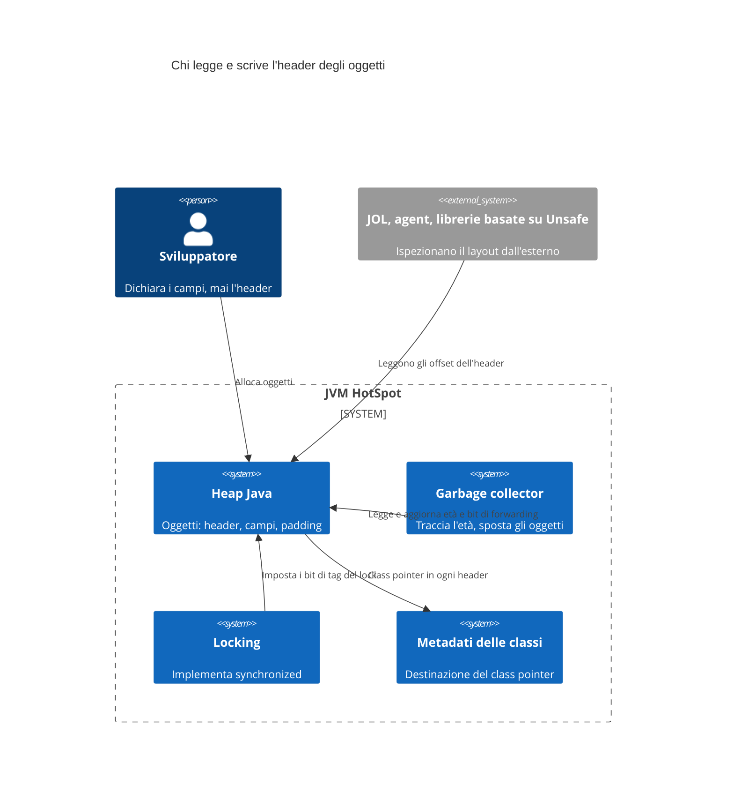
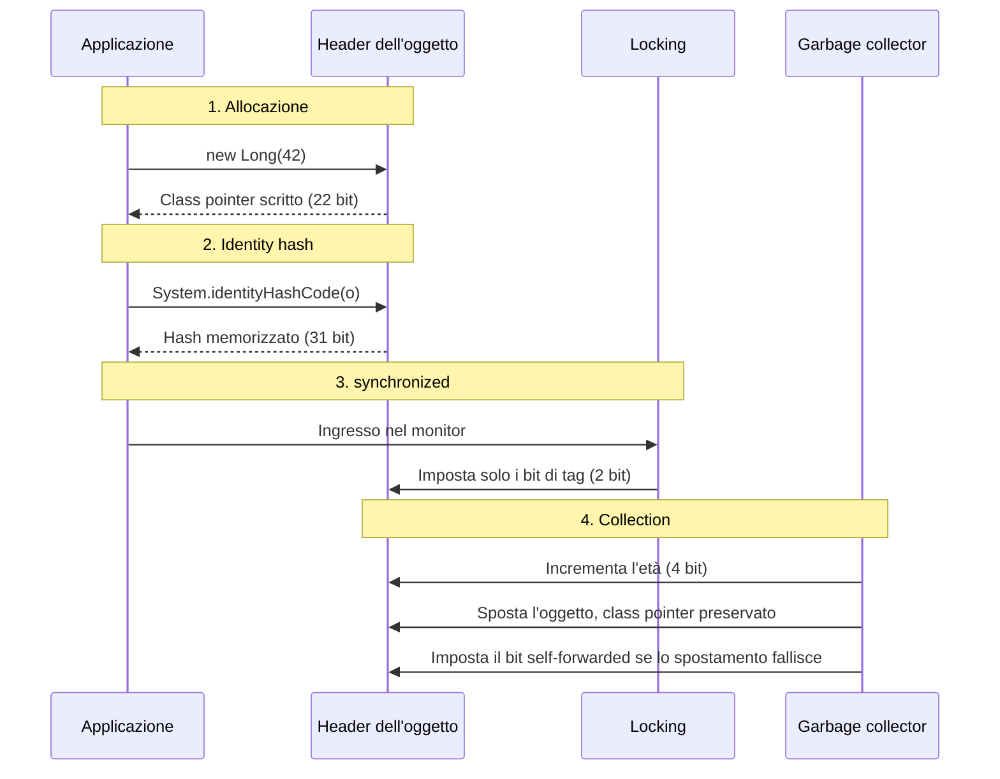
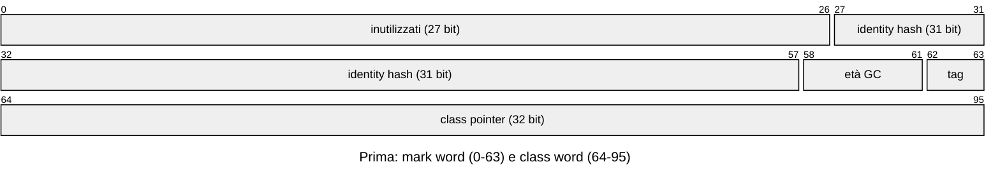
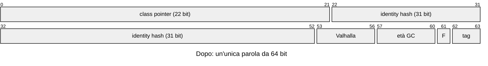

Java è arrivato alla versione 27 nel settembre 2026, trent'anni dopo il JDK 1.0, e uno dei cambiamenti più rilevanti di questa release non compare in nessuna riga di codice: ogni oggetto nella JVM ha ora, per impostazione predefinita, un header di 8 byte invece di 12.

Qui si incrociano due storie. Una è l'evoluzione del linguaggio e della piattaforma, release dopo release. L'altra è l'header degli oggetti: che cos'è, perché costava così tanto e come Project Lilliput è riuscito a ridurlo senza rompere la JVM. Ridurre l'header è stato possibile solo perché, nel corso di varie release, la piattaforma ha rimosso o riscritto vecchi componenti che occupavano quei bit.

## Il problema

Ogni oggetto nell'heap di HotSpot inizia con un header che il programmatore non dichiara mai, e fino a Java 26 occupava 12 byte nella configurazione predefinita a 64 bit. È lì che la JVM conserva ciò che le serve sapere sull'oggetto, prima dei campi.

Sembra poco, ma gli oggetti Java sono piccoli. Secondo il JEP 450, in molti carichi di lavoro l'oggetto medio è di 32-64 byte, il che significa che oltre il 20% dei dati vivi può essere costituito dai soli header. Su un heap da 10 GB sono circa 2 GB spesi prima del primo campo.

C'è poi l'allineamento: la JVM arrotonda la dimensione di ogni oggetto a un multiplo di 8 byte. Un `new Object()` usa 12 byte di header più 4 di padding, per un totale di 16 byte per un oggetto senza alcun campo.

## Che cos'è l'header degli oggetti

L'header tradizionale ha due parti:

- **Mark word (64 bit):** contiene l'identity hash (31 bit, il valore di `System.identityHashCode`), l'età dell'oggetto per il garbage collector (4 bit) e i bit di stato del lock usati da `synchronized` (2 bit). Il resto era inutilizzato.
- **Class word (32 o 64 bit):** il puntatore ai metadati della classe. Con i compressed class pointer, che sono il default, occupa 32 bit; senza compressione, 64.

In totale sono 96 bit (12 byte) nel caso comune e 128 bit (16 byte) senza compressione. Gli array aggiungono altri 4 byte per la lunghezza.

Il modello mentale: l'header è la contabilità interna della JVM, condivisa da tre sottosistemi che reclamano ciascuno qualche bit. Il garbage collector, il codice di locking e i metadati delle classi leggono e scrivono le stesse parole, ed è per questo che cambiare il layout significa cambiarli tutti e tre.

### Contesto del sistema



### La vita di un oggetto nell'header



## Compact Object Headers: tutto in 64 bit

L'idea di Project Lilliput è semplice da enunciare: spostare il class pointer dentro la mark word, usando i bit rimasti inutilizzati, ed eliminare la class word. L'header scende da 12 a 8 byte.

Per starci, il compressed class pointer è passato da 32 a 22 bit, che consentono comunque circa 4 milioni di classi caricate. L'identity hash ha mantenuto i suoi 31 bit e 4 bit sono stati riservati a Project Valhalla.

Prima, 96 bit (12 byte): una mark word da 64 bit seguita da una class word da 32 bit.



Dopo, 64 bit (8 byte): il class pointer vive dentro la mark word.



*Layout semplificato dell'header in HotSpot a 64 bit. `tag` sono i 2 bit di tag del lock, `F` il bit self-forwarded, `Valhalla` i 4 bit riservati a Project Valhalla.*

I 27 bit inutilizzati della vecchia mark word assorbono il class pointer ridotto, i 4 bit di Valhalla e il bit di self-forwarding; la class word scompare.

La parte difficile era che la vecchia JVM sovrascriveva la mark word in due situazioni, e ora questo cancellerebbe la classe dell'oggetto:

- **Locking:** il vecchio schema di `synchronized` sostituiva la mark word con un puntatore nello stack del thread. La soluzione è stata il lightweight locking, che usa solo i bit di tag, con i monitor tenuti in una tabella separata.
- **Garbage collection:** quando spostavano un oggetto, i collector scrivevano il nuovo indirizzo sopra l'header. Ora un bit dedicato marca un oggetto che non è stato possibile spostare (self-forwarded), e la compattazione usa una codifica che preserva il class pointer. ZGC non ha avuto bisogno di modifiche, perché usa già tabelle separate.

La consegna è avvenuta in tre passi, uno per JEP:

| JEP | Versione | Stato | Come si usa |
| --- | --- | --- | --- |
| [JEP 450](https://openjdk.org/jeps/450) | Java 24 | Sperimentale | `-XX:+UnlockExperimentalVMOptions -XX:+UseCompactObjectHeaders` |
| [JEP 519](https://openjdk.org/jeps/519) | Java 25 (LTS) | Funzionalità di prodotto, disattivata di default | `-XX:+UseCompactObjectHeaders` |
| [JEP 534](https://openjdk.org/jeps/534) | Java 27 | Attiva di default | Niente; per disattivarla, `-XX:-UseCompactObjectHeaders` |

Tra l'esperimento e il default, Oracle ha eseguito l'intera suite di test del JDK con la funzionalità attiva, e Amazon l'ha messa in produzione su centinaia di servizi, la maggior parte con backport su JDK 17 e 21.

## Il guadagno in pratica

Il JEP 450 riporta una riduzione tipica dal 10% al 20% dei dati vivi nell'heap, senza alcuna modifica al codice applicativo. Meno memoria per oggetto significa anche più oggetti per linea di cache e meno lavoro per il collector.

I numeri pubblicati nei JEP 519 e 534:

- SPECjbb2015: 22% di heap in meno e 8% di tempo CPU in meno.
- In un'altra configurazione dello stesso benchmark: 15% di garbage collection in meno, sia con G1 sia con Parallel.
- Un benchmark di parsing JSON altamente parallelo: 10% di tempo di esecuzione in meno.

### Non tutti gli oggetti si restringono

A causa dell'allineamento a 8 byte, il guadagno dipende dalla dimensione dei campi. I valori qui sotto derivano dall'aritmetica header + campi + allineamento nella configurazione predefinita a 64 bit; JOL mostra il layout reale su qualsiasi JVM.

| Oggetto | Header da 12 byte | Header da 8 byte |
| --- | --- | --- |
| `new Object()` | 16 byte | 8 byte |
| `Long` | 24 byte | 16 byte |
| `Integer` | 16 byte | 16 byte |
| `String` (senza l'array interno) | 24 byte | 24 byte |
| Header di un array | 16 byte | 12 byte |

Un `Integer` resta a 16 byte perché 8 di header più 4 per l'`int` fanno 12, che l'allineamento arrotonda a 16. Il guadagno reale di un'applicazione è la media su tutti i suoi oggetti.

### Come misurare

JOL (Java Object Layout), uno strumento dello stesso OpenJDK, mostra il layout di qualsiasi classe. Conviene usare una versione recente e confrontare con la funzionalità attiva e disattiva:

```bash
java -XX:+UseCompactObjectHeaders -jar jol-cli.jar internals java.lang.Long
java -XX:-UseCompactObjectHeaders -jar jol-cli.jar internals java.lang.Long
```

Per l'effetto sull'intera applicazione, si confrontano l'occupazione dell'heap dopo un full GC e la frequenza delle collection nei log (`-Xlog:gc`) a parità di carico.

## Limiti e avvertenze

- **Limite di classi:** un class pointer a 22 bit consente circa 4 milioni di classi. Basta per praticamente qualsiasi sistema, ma chi genera classi dinamicamente su larga scala dovrebbe tenerlo d'occhio.
- **I compressed class pointer sono obbligatori:** l'header compatto dipende da essi.
- **Heap giganti:** al di fuori di ZGC, la codifica usata durante la compattazione indirizza fino a 8 TB di heap.
- **Codice che presuppone il layout:** le librerie che usano `sun.misc.Unsafe` con offset fissi, o gli agent che leggono direttamente l'header, vanno aggiornati.
- **Nessun bit libero:** l'header è pieno. Il JEP 534 osserva che, se nuove funzionalità avranno bisogno di bit, il class pointer e l'hash possono ridursi ulteriormente, con tecniche già prototipate in Lilliput.

Su Java 25 la funzionalità si può attivare oggi con un flag e misurare. Sulla 27 è già attiva.

## Storia: trent'anni di release

### Le origini (1996-2002): dalla 1.0 alla 1.4

Java è nato in Sun Microsystems con la promessa del «write once, run anywhere»: codice compilato in bytecode ed eseguito da una macchina virtuale. I primi anni sono serviti a costruire la libreria standard e la JVM stessa.

| Versione | Rilascio | Che cosa ha portato |
| --- | --- | --- |
| JDK 1.0 | gen 1996 | Linguaggio, JVM, applet, AWT |
| JDK 1.1 | feb 1997 | Inner class, JDBC, RMI, reflection, JavaBeans |
| J2SE 1.2 | dic 1998 | Collections Framework, Swing, compilatore JIT |
| J2SE 1.3 | mag 2000 | HotSpot come JVM predefinita, JNDI, proxy dinamici |
| J2SE 1.4 | feb 2002 | `assert`, NIO, espressioni regolari, API di logging, exception chaining |

Due tappe di questo periodo contano ancora oggi. Il Collections Framework (1.2) ha reso `List`, `Map` e `Set` il vocabolario comune di tutto il codice Java. E HotSpot (1.3) è la stessa JVM il cui header degli oggetti è analizzato qui sopra.

### Il linguaggio matura (2004-2014): dalla 5 alla 8

Quattro release in dieci anni, ma due di esse, la 5 e la 8, hanno cambiato il linguaggio più di tutte le precedenti messe insieme.

| Versione | Rilascio | Che cosa ha portato |
| --- | --- | --- |
| Java 5 | set 2004 | Generics, annotazioni, enum, autoboxing, varargs, for-each, `java.util.concurrent` |
| Java 6 | dic 2006 | API di scripting, API del compilatore, miglioramenti di prestazioni della JVM |
| Java 7 | lug 2011 | try-with-resources, operatore diamond, `String` nello `switch`, multi-catch, NIO.2, fork/join, `invokedynamic` |
| Java 8 | mar 2014 | Lambda, Stream, `java.time`, metodi di default nelle interfacce, `Optional`, fine del PermGen |

Java 5 ha dato al linguaggio la type safety nelle collezioni e una libreria di concorrenza di alto livello. Java 7 è stata la prima release sotto Oracle, che ha acquisito Sun nel 2010, e l'`invokedynamic` che ha introdotto è diventato la base delle lambda tre anni dopo.

Java 8 ha portato lo stile funzionale nel codice di tutti i giorni:

```java
List<String> names = people.stream()
    .filter(p -> p.getAge() >= 18)
    .map(Person::getName)
    .sorted()
    .collect(Collectors.toList());
```

È diventata la release più longeva nella storia della piattaforma, e molti sistemi enterprise ci girano ancora sopra.

### La nuova cadenza (2017-2021): dalla 9 alla 17

A partire da Java 9 la piattaforma ha iniziato a pubblicare una release ogni sei mesi, a marzo e a settembre. Le funzionalità più grandi arrivano prima come preview, raccolgono feedback e solo dopo vengono finalizzate. Alcune release sono LTS (long-term support): 11, 17, 21 e 25.

| Versione | Rilascio | Che cosa ha portato |
| --- | --- | --- |
| Java 9 | set 2017 | Sistema di moduli (JPMS), JShell, G1 come collector predefinito, compact strings |
| Java 10 | mar 2018 | `var` per le variabili locali |
| Java 11 (LTS) | set 2018 | Nuovo `HttpClient`, avvio diretto di un file `.java`, ZGC sperimentale, rimozione dei moduli Java EE e CORBA |
| Java 12 | mar 2019 | Espressioni `switch` (preview), Shenandoah sperimentale |
| Java 13 | set 2019 | Text block (preview) |
| Java 14 | mar 2020 | Espressioni `switch` definitive, record e pattern matching per `instanceof` (preview), messaggi utili per le NullPointerException |
| Java 15 | set 2020 | Text block definitivi, sealed class (preview), ZGC e Shenandoah pronti per la produzione, biased locking deprecato |
| Java 16 | mar 2021 | Record e pattern matching per `instanceof` definitivi, incapsulamento forte degli internals del JDK |
| Java 17 (LTS) | set 2021 | Sealed class definitive, port macOS/AArch64 |

Record, sealed class e pattern matching insieme hanno cambiato il modo di modellare i dati:

```java
sealed interface Shape permits Circle, Rectangle {}
record Circle(double radius) implements Shape {}
record Rectangle(double width, double height) implements Shape {}
```

Nella tabella ci sono due voci discrete da notare. Le compact strings di Java 9 erano già un risparmio di memoria invisibile al programmatore, nello stesso spirito dell'header compatto. E la deprecazione del biased locking in Java 15 ha liberato bit nell'header degli oggetti, uno dei passi che hanno aperto la strada alla riduzione.

### Java moderno (2022-2026): dalla 18 alla 27

Negli ultimi quattro anni i grandi progetti di lungo corso di OpenJDK hanno iniziato a consegnare: Loom (virtual thread), Amber (pattern matching e sintassi più snella), Panama (interoperabilità con il codice nativo) e Lilliput (header compatti).

| Versione | Rilascio | Che cosa ha portato |
| --- | --- | --- |
| Java 18 | mar 2022 | UTF-8 come charset predefinito, simple web server |
| Java 19 | set 2022 | Virtual thread e record pattern (preview) |
| Java 20 | mar 2023 | Ulteriori cicli di preview, scoped values in incubazione |
| Java 21 (LTS) | set 2023 | Virtual thread definitivi, record pattern, pattern matching per `switch`, sequenced collections, ZGC generazionale |
| Java 22 | mar 2024 | API Foreign Function & Memory (FFM) definitiva, variabili e pattern senza nome (`_`) |
| Java 23 | set 2024 | Commenti di documentazione in Markdown, ZGC generazionale di default |
| Java 24 | mar 2025 | Stream gatherers, class-file API, virtual thread senza pinning su `synchronized`, header compatti sperimentali (JEP 450) |
| Java 25 (LTS) | set 2025 | Scoped values definitivi, flexible constructor bodies, compact source files e `main` di istanza, header compatti come funzionalità di prodotto (JEP 519), Shenandoah generazionale |
| Java 26 | mar 2026 | HTTP/3 in `HttpClient`, rimozione dell'API Applet, AOT object caching con qualsiasi GC, «prepare to make final mean final» |
| Java 27 | set 2026 | Header compatti di default (JEP 534), G1 come collector predefinito in tutti gli ambienti, scambio di chiavi ibrido post-quantum per TLS 1.3 |

I virtual thread di Java 21 permettono di scrivere semplice codice bloccante che scala a centinaia di migliaia di task concorrenti:

```java
try (var executor = Executors.newVirtualThreadPerTaskExecutor()) {
    orders.forEach(o -> executor.submit(() -> process(o)));
}
```

E il pattern matching per `switch` chiude il cerchio aperto da record e sealed class:

```java
double area = switch (shape) {
    case Circle c -> Math.PI * c.radius() * c.radius();
    case Rectangle r -> r.width() * r.height();
};
```

Java 25 ha semplificato perfino il primo programma di chi sta imparando:

```java
void main() {
    IO.println("Hello, world!");
}
```

## Cosa rende buona un'ottimizzazione di piattaforma

1. **Invisibile al programmatore.** Nessuna API, nessuna annotazione, nessuna modifica al codice: si aggiorna la JVM e il guadagno c'è.
2. **Prima si salda il vecchio debito.** Il biased locking doveva sparire, e locking e collection dovevano smettere di sovrascrivere la mark word, prima che i bit potessero essere riutilizzati.
3. **Consegnata per gradi.** Sperimentale nella 24, funzionalità di prodotto nella 25, default nella 27, ogni passo sostenuto da più evidenze del precedente.
4. **Provata su carichi reali.** L'intera suite di test del JDK e centinaia di servizi in produzione sono venuti prima del default.
5. **Resta un interruttore.** `-XX:-UseCompactObjectHeaders` ripristina il vecchio layout per il codice che ancora lo presuppone.

## Dove va da qui

Java 27 è la release corrente e non è LTS; chi ha bisogno di supporto a lungo termine è sulla 25. Ancora in preview nella 27: lazy constants, structured concurrency e tipi primitivi nei pattern. Nell'header non restano bit liberi, quindi le prossime funzionalità che ne avranno bisogno, Valhalla per prima, li prenderanno dai bit riservati o da un class pointer e un hash che si riducono ancora.

In trent'anni Java si è evoluto su due fronti contemporaneamente. Il linguaggio ha acquisito generics, lambda, record e pattern matching, diventando più espressivo a ogni ciclo. La piattaforma sottostante ha continuato a diventare più efficiente senza chiedere nulla in cambio al programmatore. L'header compatto è il miglior esempio di questo secondo fronte: anni di lavoro in Project Lilliput, tre JEP e modifiche profonde a locking e garbage collection, perché il risultato finale fosse questo: aggiornare la JVM e usare dal 10% al 20% di memoria in meno.

## Approfondimenti

- [JEP 450: Compact Object Headers (Experimental)](https://openjdk.org/jeps/450) — Il design originale: il nuovo layout, il lightweight locking e le modifiche al forwarding.
- [JEP 519: Compact Object Headers](https://openjdk.org/jeps/519) — La promozione a funzionalità di prodotto in Java 25, con i risultati dei benchmark.
- [JEP 534: Compact Object Headers by Default](https://openjdk.org/jeps/534) — Il passaggio ad attivo di default in Java 27 e cosa succede quando serviranno altri bit.
- [JDK 27: elenco delle funzionalità](https://openjdk.org/projects/jdk/27/) — Tutti i JEP della release corrente; le release precedenti sono indicizzate su [openjdk.org/projects/jdk](https://openjdk.org/projects/jdk/).
- [Project Lilliput](https://openjdk.org/projects/lilliput/) — Il progetto OpenJDK dietro la riduzione dell'header.
- [JOL (Java Object Layout)](https://openjdk.org/projects/code-tools/jol/) — Lo strumento per ispezionare il layout degli oggetti su una JVM in esecuzione.

---

**Ivens Signorini** è un Senior Backend Engineer specializzato in sistemi distribuiti, infrastruttura AI e API ad alte prestazioni. Lavora principalmente in Go e TypeScript, costruendo sistemi che operano su larga scala. I suoi interessi tecnici includono il design dei protocolli, i pattern di concorrenza e l'architettura delle applicazioni AI-native. Scrive su [signorini.cloud](https://signorini.cloud).
