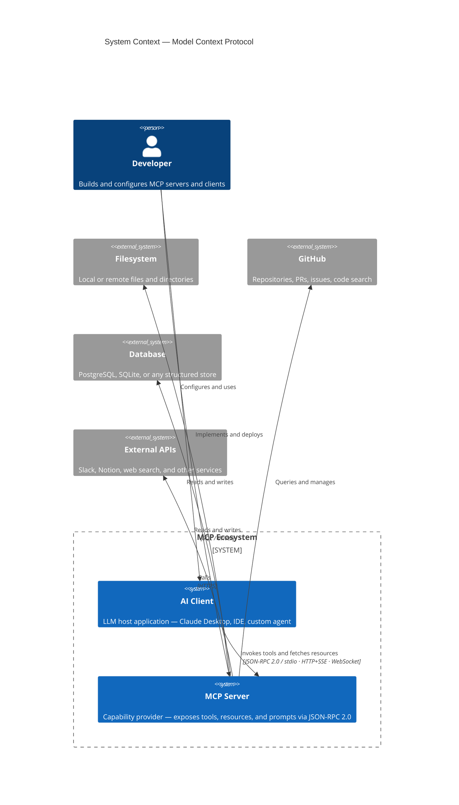
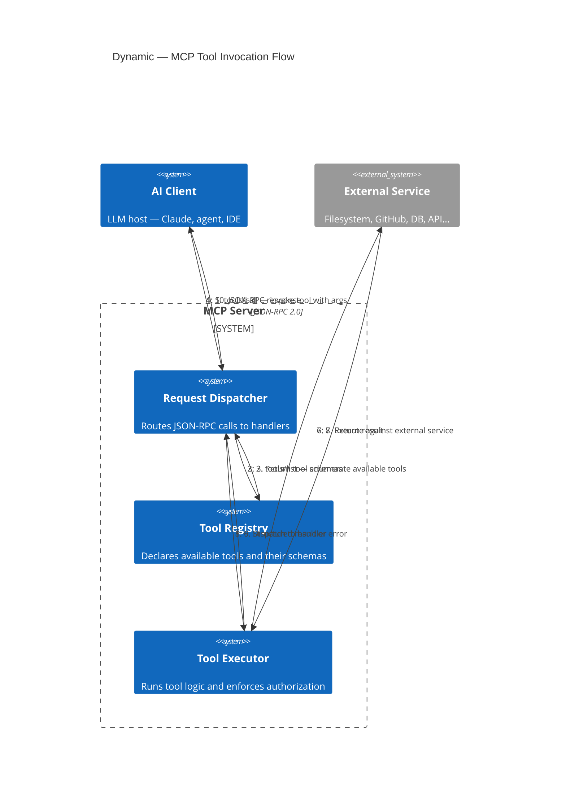
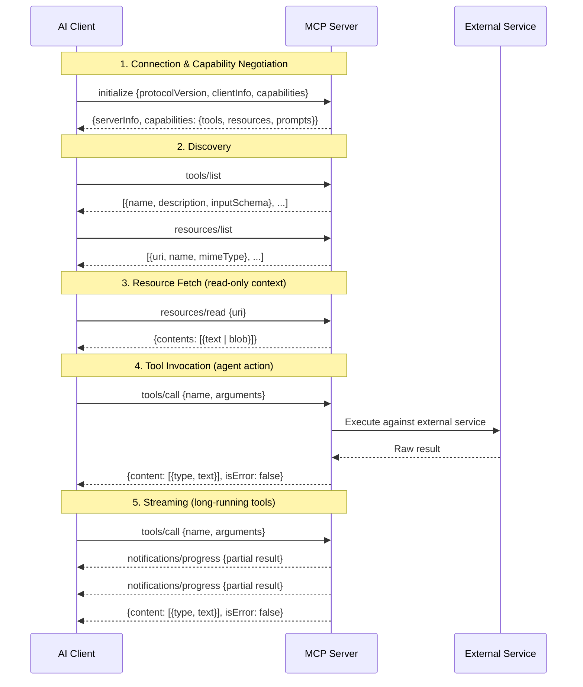

AI models are extraordinary at reasoning. They're terrible at acting — or at least they were, until they had a standardized way to reach outside themselves. MCP is that way.

## The problem before MCP

In 2023, if you wanted an LLM to read a file, query a database, or call an API, you wrote custom glue code. Every team reinvented the same wheel: a thin layer that serialized context, passed it to the model, parsed tool calls out of the response, executed them, and fed results back. There was no standard. Every integration was a one-off.

The result was a fragmented ecosystem. Models couldn't reuse tooling across products. Developers couldn't share adapters. Security boundaries were inconsistent. And the complexity scaled with every new tool added.

## What MCP is

**MCP — Model Context Protocol** — is an open protocol published by Anthropic in November 2024. It defines a standard communication interface between AI models (clients) and external services (servers).

The mental model is simple: MCP servers are plugins. They expose **resources** (data the model can read), **tools** (actions the model can invoke), and **prompts** (reusable instruction templates). The model is always the client; the server is always the capability provider.

### System context

### Request flow

The wire protocol is **JSON-RPC 2.0**, running over stdio, HTTP+SSE, or WebSocket depending on deployment context. This is deliberately boring: it means any language can implement it, any infra can host it, and any model can speak it.

## Protocol sequence

The full lifecycle of an MCP session — from handshake to tool result:

## Protocol anatomy

An MCP server exposes three primitive types:

**Resources** — read-only context. A resource could be a file, a database row, a Slack message, a GitHub PR. The server declares what it has; the model decides what to fetch.

**Tools** — callable actions with typed schemas. When a model decides to invoke a tool, it sends a structured JSON call. The server executes it and returns a result. Tools are what make models agents — they turn reasoning into effect.

**Prompts** — parameterized instruction templates. Think of them as server-defined slash commands: reusable patterns the client can invoke with arguments.

All three are declared through a capability negotiation handshake at connection time. The model always knows exactly what a server offers before it tries to use anything.

## Why AI systems adopted it

The adoption argument is straightforward: **one integration, many clients**.

Before MCP, if you built a filesystem adapter for Claude, it worked for Claude. Porting it to another model meant rewriting the interface layer. With MCP, you write the server once. Any MCP-compatible client can use it.

For AI system builders, this is significant. It means:

- **Tool libraries are reusable** across models and products
- **Security is enforced at the server boundary**, not scattered across prompt templates
- **Capability discovery is automatic** — the model negotiates what's available at runtime
- **Streaming is native** — long-running tools can push partial results without polling

The ecosystem effect compounds quickly. Once a GitHub MCP server exists, every model that speaks MCP gets GitHub integration for free. Once a Postgres server exists, every product built on MCP gets structured query access without custom work.

## History and adoption timeline

- **November 2024** — Anthropic publishes MCP specification and open-sources reference implementations in Python and TypeScript. Claude Desktop ships as the first MCP client.
- **Early 2025** — Community MCP server catalog grows past 1,000 implementations. Major integrations: GitHub, Slack, Notion, filesystem, Docker, web search.
- **Mid 2025** — OpenAI, Google DeepMind, and several open-source model providers announce MCP support. The protocol moves from Anthropic-specific to effectively industry standard.
- **Late 2025** — Enterprise tooling vendors (Atlassian, Linear, Salesforce) ship first-party MCP servers. IDE vendors embed MCP clients natively.
- **2026** — MCP is the assumed integration layer for any serious AI product. Not speaking it is now the exception.

The speed of adoption tracks the speed at which developers realized the alternative — custom glue code forever — was not sustainable.

## What makes a good MCP server

Not all servers are equal. A well-designed MCP server:

1. **Keeps tools focused** — one tool, one purpose. A search tool should not also write.
2. **Returns structured output** — typed JSON, not free text, so the model can reason over results reliably.
3. **Fails loudly** — errors returned as proper error objects, not buried in result strings.
4. **Respects authorization** — the server, not the model, decides what the caller is allowed to do.
5. **Is stateless where possible** — context should live in resources, not in server memory.

These are the same principles that make any good API. MCP doesn't change software design — it just applies it at the AI integration layer.

## Where it goes from here

The interesting frontier is **multi-server orchestration**: a single model session connecting to dozens of MCP servers simultaneously, combining capabilities dynamically. Think of a coding agent with simultaneous access to your codebase, GitHub, your issue tracker, your CI logs, and your documentation — all through a single protocol.

The other frontier is **server-to-server composition**: MCP servers that themselves call other MCP servers, building capability graphs rather than flat tool lists.

MCP didn't invent the idea of AI tool use. It standardized it. And in software, standardization is usually where the real leverage lives.

---

## Further reading

- [MCP Official Specification](https://modelcontextprotocol.io/specification) — Anthropic's canonical protocol reference
- [MCP GitHub Repository](https://github.com/modelcontextprotocol) — reference implementations in Python and TypeScript
- [Introducing the Model Context Protocol](https://www.anthropic.com/news/model-context-protocol) — Anthropic's original announcement post
- [JSON-RPC 2.0 Specification](https://www.jsonrpc.org/specification) — the wire protocol MCP runs on
- [awesome-mcp-servers](https://github.com/punkpeye/awesome-mcp-servers) — community-curated list of MCP server implementations

---

## About the author

**Ivens Signorini** is a Senior Backend Engineer focused on distributed systems, AI infrastructure, and high-performance APIs. He works primarily in Go and TypeScript, building systems that run at scale. His technical interests include protocol design, concurrency patterns, and the architecture of AI-native applications. He writes at [signorini.cloud](https://signorini.cloud).
