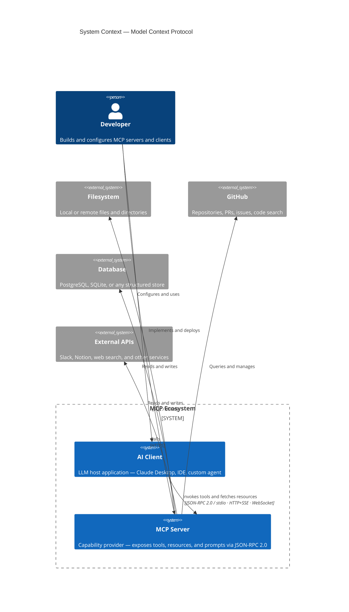
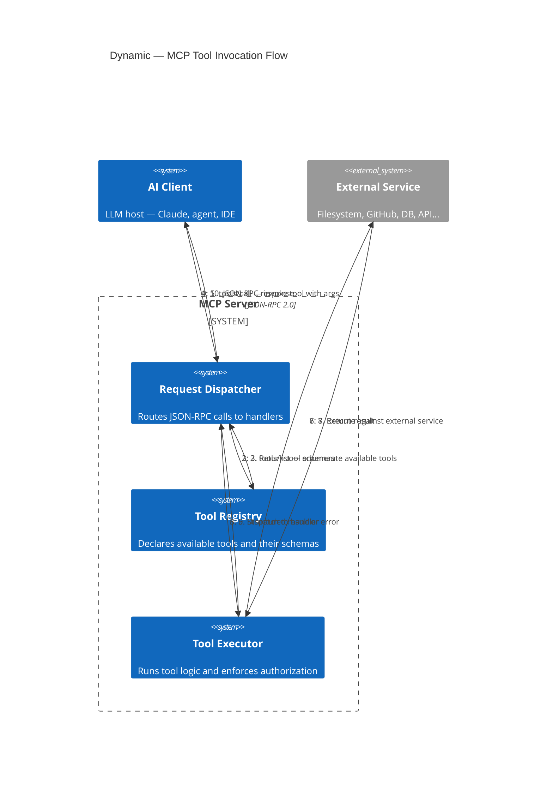
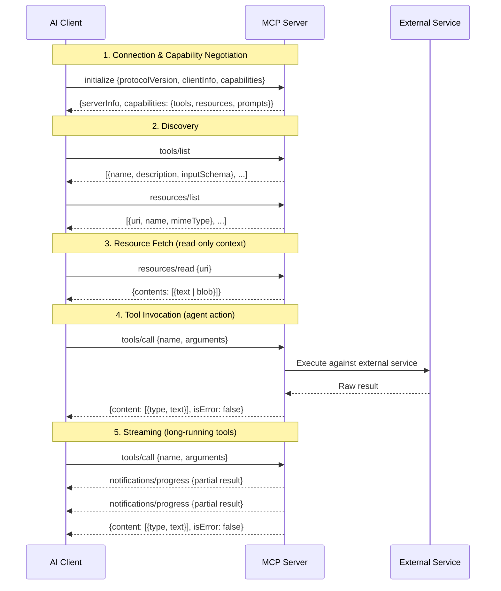

Los modelos de IA son extraordinarios razonando. Son pésimos actuando — o al menos lo eran, hasta que tuvieron una forma estandarizada de extenderse hacia el exterior. MCP es esa forma.

## El problema antes de MCP

En 2023, si querías que un LLM leyera un archivo, consultara una base de datos o llamara a una API, escribías código glue personalizado. Cada equipo reinventaba la misma rueda: una capa delgada que serializaba el contexto, lo pasaba al modelo, parseaba las llamadas a herramientas de la respuesta, las ejecutaba y devolvía los resultados. No había estándar. Cada integración era un caso aislado.

El resultado fue un ecosistema fragmentado. Los modelos no podían reutilizar herramientas entre productos. Los desarrolladores no podían compartir adaptadores. Los límites de seguridad eran inconsistentes. Y la complejidad escalaba con cada nueva herramienta añadida.

## Qué es MCP

**MCP — Model Context Protocol** — es un protocolo abierto publicado por Anthropic en noviembre de 2024. Define una interfaz de comunicación estándar entre modelos de IA (clientes) y servicios externos (servidores).

El modelo mental es simple: los servidores MCP son plugins. Exponen **recursos** (datos que el modelo puede leer), **tools** (acciones que el modelo puede invocar) y **prompts** (plantillas de instrucciones reutilizables). El modelo es siempre el cliente; el servidor es siempre el proveedor de capacidades.

### Contexto del sistema

### Flujo de solicitud

El protocolo wire es **JSON-RPC 2.0**, corriendo sobre stdio, HTTP+SSE o WebSocket según el contexto de despliegue. Es deliberadamente aburrido: significa que cualquier lenguaje puede implementarlo, cualquier infraestructura puede alojarlo, y cualquier modelo puede hablarlo.

## Secuencia del protocolo

El ciclo de vida completo de una sesión MCP — desde el handshake hasta el resultado del tool:

## Anatomía del protocolo

Un servidor MCP expone tres tipos primitivos:

**Recursos** — contexto de solo lectura. Un recurso puede ser un archivo, una fila de base de datos, un mensaje de Slack, una PR de GitHub. El servidor declara lo que tiene; el modelo decide qué recuperar.

**Tools** — acciones invocables con esquemas tipados. Cuando un modelo decide invocar una herramienta, envía una llamada JSON estructurada. El servidor la ejecuta y devuelve un resultado. Los tools son lo que convierte a los modelos en agentes — transforman el razonamiento en efecto.

**Prompts** — plantillas de instrucciones parametrizadas. Piénsalos como slash commands definidos por el servidor: patrones reutilizables que el cliente puede invocar con argumentos.

Los tres se declaran a través de un handshake de negociación de capacidades en el momento de la conexión. El modelo siempre sabe exactamente qué ofrece un servidor antes de intentar usar algo.

## Por qué los sistemas de IA lo adoptaron

El argumento de adopción es directo: **una integración, muchos clientes**.

Antes de MCP, si construías un adaptador de filesystem para Claude, funcionaba para Claude. Portarlo a otro modelo significaba reescribir la capa de interfaz. Con MCP, escribes el servidor una vez. Cualquier cliente compatible con MCP puede usarlo.

Para quienes construyen sistemas de IA, esto es significativo. Significa:

- **Las bibliotecas de tools son reutilizables** entre modelos y productos
- **La seguridad se aplica en el límite del servidor**, no dispersa entre plantillas de prompts
- **El descubrimiento de capacidades es automático** — el modelo negocia qué está disponible en runtime
- **El streaming es nativo** — los tools de larga ejecución pueden enviar resultados parciales sin polling

El efecto ecosistema se amplifica rápidamente. Una vez que existe un servidor MCP para GitHub, todo modelo que hable MCP obtiene integración con GitHub de forma gratuita. Una vez que existe un servidor Postgres, todo producto construido sobre MCP obtiene acceso a consultas estructuradas sin trabajo personalizado.

## Historia y línea de tiempo de adopción

- **Noviembre 2024** — Anthropic publica la especificación MCP y libera como open source las implementaciones de referencia en Python y TypeScript. Claude Desktop se lanza como el primer cliente MCP.
- **Principios de 2025** — El catálogo community de servidores MCP supera las 1.000 implementaciones. Integraciones principales: GitHub, Slack, Notion, filesystem, Docker, web search.
- **Mediados de 2025** — OpenAI, Google DeepMind y varios proveedores de modelos open source anuncian soporte para MCP. El protocolo pasa de ser específico de Anthropic a estándar de facto de la industria.
- **Finales de 2025** — Los vendors de tooling empresarial (Atlassian, Linear, Salesforce) lanzan servidores MCP de primera parte. Los vendors de IDE integran nativamente clientes MCP.
- **2026** — MCP es la capa de integración asumida para cualquier producto de IA serio. No hablarlo es ahora la excepción.

La velocidad de adopción sigue la velocidad a la que los desarrolladores entendieron que la alternativa — código glue personalizado para siempre — no era sostenible.

## Qué hace a un buen servidor MCP

No todos los servidores son iguales. Un servidor MCP bien diseñado:

1. **Mantiene los tools enfocados** — una herramienta, un propósito. Una herramienta de búsqueda no debería también escribir.
2. **Devuelve output estructurado** — JSON tipado, no texto libre, para que el modelo pueda razonar sobre los resultados de forma confiable.
3. **Falla ruidosamente** — los errores se devuelven como objetos error propios, no enterrados en strings de resultado.
4. **Respeta la autorización** — es el servidor, no el modelo, quien decide qué puede hacer el llamante.
5. **Es stateless donde sea posible** — el contexto debe vivir en los recursos, no en la memoria del servidor.

Estos son los mismos principios que hacen buena a cualquier API. MCP no cambia el diseño de software — simplemente lo aplica en la capa de integración de IA.

## Hacia dónde va desde aquí

La frontera interesante es la **orquestación multi-servidor**: una única sesión de modelo conectándose a decenas de servidores MCP simultáneamente, combinando capacidades de forma dinámica. Imagina un agente de coding con acceso simultáneo a tu codebase, GitHub, tu issue tracker, tus logs de CI y tu documentación — todo a través de un único protocolo.

La otra frontera es la **composición servidor a servidor**: servidores MCP que a su vez llaman a otros servidores MCP, construyendo grafos de capacidades en lugar de listas planas de tools.

MCP no inventó la idea del uso de tools por parte de la IA. La estandarizó. Y en software, la estandarización es usualmente donde vive el verdadero apalancamiento.

---

## Lecturas adicionales

- [Especificación oficial de MCP](https://modelcontextprotocol.io/specification) — referencia canónica del protocolo de Anthropic
- [Repositorio GitHub de MCP](https://github.com/modelcontextprotocol) — implementaciones de referencia en Python y TypeScript
- [Presentando el Model Context Protocol](https://www.anthropic.com/news/model-context-protocol) — post de anuncio original de Anthropic
- [Especificación JSON-RPC 2.0](https://www.jsonrpc.org/specification) — el protocolo wire sobre el que corre MCP
- [awesome-mcp-servers](https://github.com/punkpeye/awesome-mcp-servers) — lista curada por la comunidad de implementaciones de servidores MCP

---

## Sobre el autor

**Ivens Signorini** es un Senior Backend Engineer especializado en sistemas distribuidos, infraestructura de IA y APIs de alto rendimiento. Trabaja principalmente en Go y TypeScript, construyendo sistemas que operan a escala. Sus intereses técnicos incluyen el diseño de protocolos, patrones de concurrencia y la arquitectura de aplicaciones nativas de IA. Escribe en [signorini.cloud](https://signorini.cloud).
