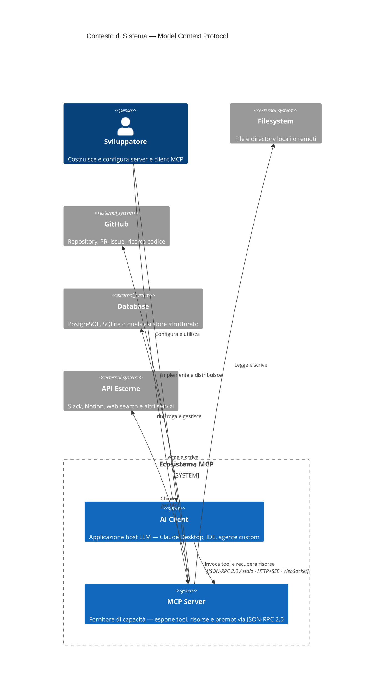
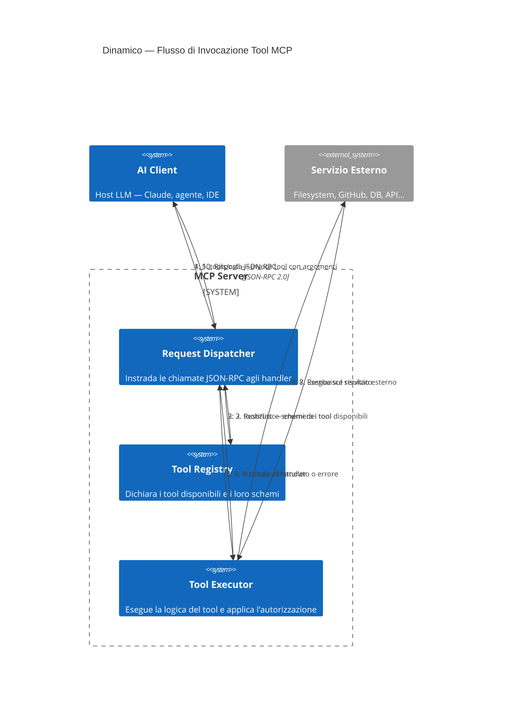
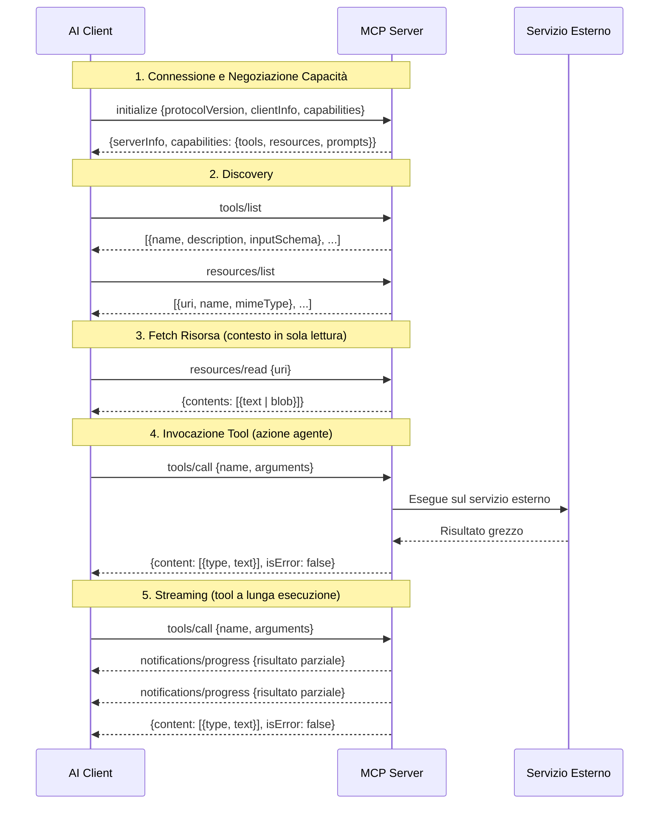

I modelli AI sono straordinari nel ragionare. Sono pessimi nell'agire — o almeno lo erano, finché non hanno avuto un modo standardizzato per estendersi verso l'esterno. MCP è quel modo.

## Il problema prima di MCP

Nel 2023, se volevi che un LLM leggesse un file, interrogasse un database o chiamasse un'API, scrivevi codice glue personalizzato. Ogni team reinventava la stessa ruota: uno strato sottile che serializzava il contesto, lo passava al modello, analizzava le chiamate agli strumenti dalla risposta, le eseguiva e reindirizzava i risultati. Non esisteva uno standard. Ogni integrazione era un caso isolato.

Il risultato era un ecosistema frammentato. I modelli non potevano riutilizzare i tool tra prodotti diversi. Gli sviluppatori non potevano condividere adattatori. I confini di sicurezza erano inconsistenti. E la complessità cresceva con ogni nuovo strumento aggiunto.

## Cos'è MCP

**MCP — Model Context Protocol** — è un protocollo aperto pubblicato da Anthropic nel novembre 2024. Definisce un'interfaccia di comunicazione standard tra modelli AI (client) e servizi esterni (server).

Il modello mentale è semplice: i server MCP sono plugin. Espongono **risorse** (dati che il modello può leggere), **tool** (azioni che il modello può invocare) e **prompt** (template di istruzioni riutilizzabili). Il modello è sempre il client; il server è sempre il fornitore di capacità.

### Contesto di sistema

### Flusso di richiesta

Il protocollo wire è **JSON-RPC 2.0**, che gira su stdio, HTTP+SSE o WebSocket a seconda del contesto di deployment. È deliberatamente semplice: significa che qualsiasi linguaggio può implementarlo, qualsiasi infrastruttura può ospitarlo, e qualsiasi modello può parlarlo.

## Sequenza del protocollo

Il ciclo di vita completo di una sessione MCP — dall'handshake al risultato del tool:

## Anatomia del protocollo

Un server MCP espone tre tipi primitivi:

**Risorse** — contesto in sola lettura. Una risorsa può essere un file, una riga di database, un messaggio Slack, una PR su GitHub. Il server dichiara cosa ha; il modello decide cosa recuperare.

**Tool** — azioni invocabili con schemi tipizzati. Quando un modello decide di invocare uno strumento, invia una chiamata JSON strutturata. Il server la esegue e restituisce un risultato. I tool sono ciò che rende i modelli agenti — trasformano il ragionamento in effetto.

**Prompt** — template di istruzioni parametrizzati. Pensali come slash command definiti dal server: pattern riutilizzabili che il client può invocare con argomenti.

Tutti e tre vengono dichiarati attraverso un handshake di negoziazione delle capacità al momento della connessione. Il modello sa sempre esattamente cosa offre un server prima di provare a usare qualcosa.

## Perché i sistemi AI lo hanno adottato

L'argomento per l'adozione è diretto: **un'integrazione, molti client**.

Prima di MCP, se costruivi un adattatore filesystem per Claude, funzionava per Claude. Portarlo su un altro modello significava riscrivere il layer di interfaccia. Con MCP, scrivi il server una volta. Qualsiasi client compatibile con MCP può usarlo.

Per chi costruisce sistemi AI, questo è significativo. Significa:

- **Le librerie di tool sono riutilizzabili** tra modelli e prodotti
- **La sicurezza è applicata al confine del server**, non dispersa tra template di prompt
- **La discovery delle capacità è automatica** — il modello negozia cosa è disponibile a runtime
- **Lo streaming è nativo** — i tool a lunga esecuzione possono inviare risultati parziali senza polling

L'effetto ecosistema si amplifica rapidamente. Una volta che esiste un server MCP per GitHub, ogni modello che parla MCP ottiene l'integrazione con GitHub gratuitamente. Una volta che esiste un server Postgres, ogni prodotto costruito su MCP ottiene accesso a query strutturate senza lavoro personalizzato.

## Storia e timeline di adozione

- **Novembre 2024** — Anthropic pubblica la specifica MCP e open-sourcia le implementazioni di riferimento in Python e TypeScript. Claude Desktop viene rilasciato come primo client MCP.
- **Inizio 2025** — Il catalogo community di server MCP supera le 1.000 implementazioni. Integrazioni principali: GitHub, Slack, Notion, filesystem, Docker, web search.
- **Metà 2025** — OpenAI, Google DeepMind e diversi provider di modelli open-source annunciano il supporto MCP. Il protocollo passa da Anthropic-specifico a standard de facto del settore.
- **Fine 2025** — I vendor di tooling enterprise (Atlassian, Linear, Salesforce) rilasciano server MCP di prima parte. I vendor di IDE integrano nativamente client MCP.
- **2026** — MCP è il layer di integrazione assunto per qualsiasi prodotto AI serio. Non parlarlo è ormai l'eccezione.

La velocità di adozione rispecchia la velocità con cui gli sviluppatori hanno capito che l'alternativa — codice glue personalizzato all'infinito — non era sostenibile.

## Cosa rende un buon server MCP

Non tutti i server sono uguali. Un server MCP ben progettato:

1. **Mantiene i tool focalizzati** — uno strumento, uno scopo. Uno strumento di ricerca non dovrebbe anche scrivere.
2. **Restituisce output strutturato** — JSON tipizzato, non testo libero, così il modello può ragionare sui risultati in modo affidabile.
3. **Fallisce rumorosamente** — gli errori vengono restituiti come oggetti error propri, non nascosti nelle stringhe di risultato.
4. **Rispetta l'autorizzazione** — è il server, non il modello, a decidere cosa è permesso fare al chiamante.
5. **È stateless dove possibile** — il contesto dovrebbe vivere nelle risorse, non nella memoria del server.

Questi sono gli stessi principi che rendono buona qualsiasi API. MCP non cambia il design del software — lo applica semplicemente al layer di integrazione AI.

## Dove va da qui

La frontiera interessante è l'**orchestrazione multi-server**: una singola sessione modello che si connette a decine di server MCP simultaneamente, combinando capacità in modo dinamico. Immagina un agente di coding con accesso simultaneo al tuo codebase, GitHub, il tuo issue tracker, i log CI e la documentazione — tutto attraverso un unico protocollo.

L'altra frontiera è la **composizione server-to-server**: server MCP che chiamano a loro volta altri server MCP, costruendo grafi di capacità invece di liste piatte di tool.

MCP non ha inventato l'idea dell'uso di tool da parte dell'AI. L'ha standardizzata. E nel software, la standardizzazione è di solito dove vive la vera leva.

---

## Per approfondire

- [Specifica ufficiale MCP](https://modelcontextprotocol.io/specification) — riferimento canonico del protocollo di Anthropic
- [Repository GitHub MCP](https://github.com/modelcontextprotocol) — implementazioni di riferimento in Python e TypeScript
- [Introduzione al Model Context Protocol](https://www.anthropic.com/news/model-context-protocol) — post di annuncio originale di Anthropic
- [Specifica JSON-RPC 2.0](https://www.jsonrpc.org/specification) — il protocollo wire su cui gira MCP
- [awesome-mcp-servers](https://github.com/punkpeye/awesome-mcp-servers) — lista curata dalla community di implementazioni di server MCP

---

## Sull'autore

**Ivens Signorini** è un Senior Backend Engineer specializzato in sistemi distribuiti, infrastruttura AI e API ad alte prestazioni. Lavora principalmente in Go e TypeScript, costruendo sistemi che operano su larga scala. I suoi interessi tecnici includono il design dei protocolli, i pattern di concorrenza e l'architettura delle applicazioni AI-native. Scrive su [signorini.cloud](https://signorini.cloud).
