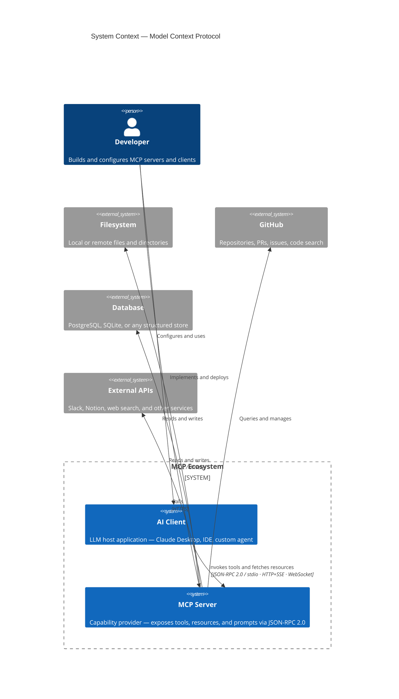
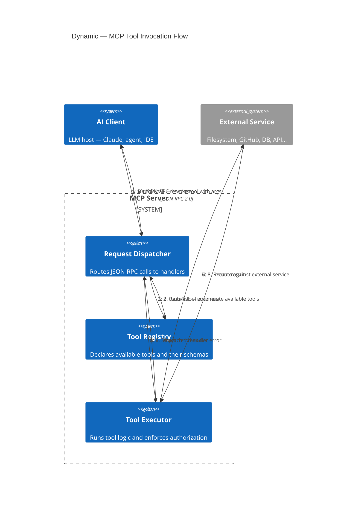
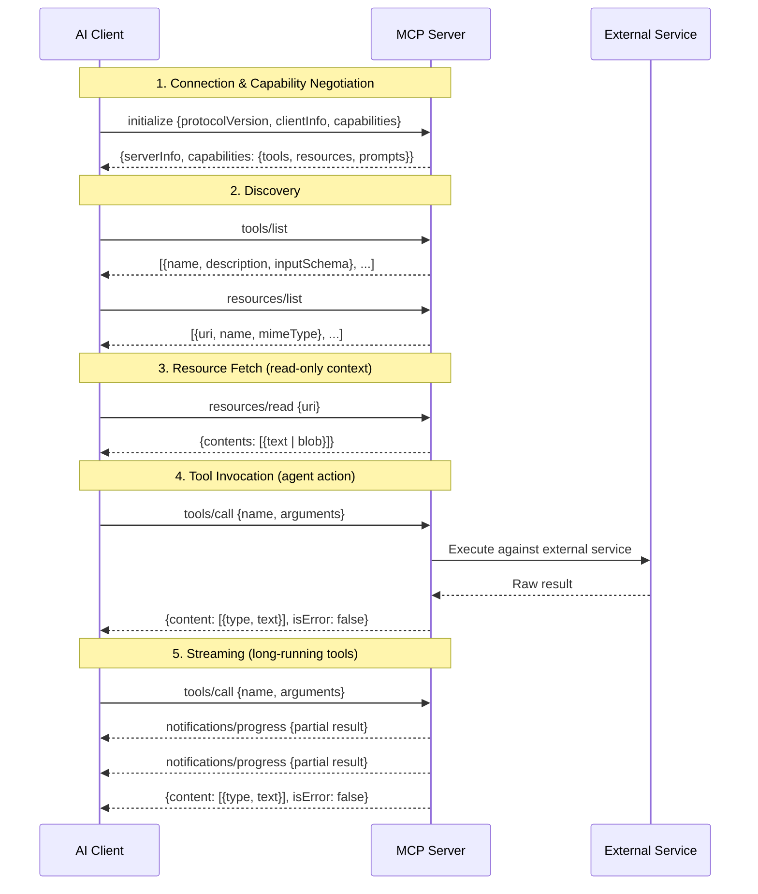

Modelos de IA são extraordinários no raciocínio. São péssimos na ação — ou pelo menos eram, até terem uma forma padronizada de se estender para o exterior. MCP é essa forma.

## O problema antes do MCP

Em 2023, se você queria que um LLM lesse um arquivo, consultasse um banco de dados ou chamasse uma API, escrevia código glue personalizado. Cada equipe reinventava a mesma roda: uma camada fina que serializava o contexto, passava ao modelo, parseava as chamadas de ferramentas da resposta, as executava e devolvia os resultados. Não havia padrão. Cada integração era um caso isolado.

O resultado foi um ecossistema fragmentado. Os modelos não podiam reutilizar ferramentas entre produtos. Os desenvolvedores não podiam compartilhar adaptadores. Os limites de segurança eram inconsistentes. E a complexidade escalava com cada nova ferramenta adicionada.

## O que é MCP

**MCP — Model Context Protocol** — é um protocolo aberto publicado pela Anthropic em novembro de 2024. Define uma interface de comunicação padrão entre modelos de IA (clientes) e serviços externos (servidores).

O modelo mental é simples: servidores MCP são plugins. Eles expõem **recursos** (dados que o modelo pode ler), **tools** (ações que o modelo pode invocar) e **prompts** (templates de instrução reutilizáveis). O modelo é sempre o cliente; o servidor é sempre o provedor de capacidades.

### Contexto do sistema

### Fluxo de requisição

O protocolo wire é **JSON-RPC 2.0**, rodando sobre stdio, HTTP+SSE ou WebSocket dependendo do contexto de deploy. É deliberadamente simples: significa que qualquer linguagem pode implementá-lo, qualquer infraestrutura pode hospedá-lo, e qualquer modelo pode falar com ele.

## Sequência do protocolo

O ciclo de vida completo de uma sessão MCP — do handshake ao resultado do tool:

## Anatomia do protocolo

Um servidor MCP expõe três tipos primitivos:

**Recursos** — contexto somente leitura. Um recurso pode ser um arquivo, uma linha de banco de dados, uma mensagem do Slack, uma PR do GitHub. O servidor declara o que tem; o modelo decide o que buscar.

**Tools** — ações invocáveis com esquemas tipados. Quando um modelo decide invocar uma ferramenta, envia uma chamada JSON estruturada. O servidor a executa e retorna um resultado. Os tools são o que torna os modelos agentes — transformam raciocínio em efeito.

**Prompts** — templates de instrução parametrizados. Pense neles como slash commands definidos pelo servidor: padrões reutilizáveis que o cliente pode invocar com argumentos.

Os três são declarados por meio de um handshake de negociação de capacidades no momento da conexão. O modelo sempre sabe exatamente o que um servidor oferece antes de tentar usar qualquer coisa.

## Por que os sistemas de IA o adotaram

O argumento de adoção é direto: **uma integração, muitos clientes**.

Antes do MCP, se você construía um adaptador de filesystem para o Claude, ele funcionava para o Claude. Portá-lo para outro modelo significava reescrever a camada de interface. Com MCP, você escreve o servidor uma vez. Qualquer cliente compatível com MCP pode usá-lo.

Para quem constrói sistemas de IA, isso é significativo. Significa:

- **Bibliotecas de tools são reutilizáveis** entre modelos e produtos
- **Segurança é aplicada no limite do servidor**, não dispersa entre templates de prompt
- **O descobrimento de capacidades é automático** — o modelo negocia o que está disponível em runtime
- **Streaming é nativo** — tools de longa execução podem enviar resultados parciais sem polling

O efeito ecossistema se amplifica rapidamente. Uma vez que existe um servidor MCP para GitHub, todo modelo que fala MCP obtém integração com GitHub de graça. Uma vez que existe um servidor Postgres, todo produto construído sobre MCP obtém acesso a consultas estruturadas sem trabalho personalizado.

## História e linha do tempo de adoção

- **Novembro 2024** — Anthropic publica a especificação MCP e libera como open source as implementações de referência em Python e TypeScript. Claude Desktop é lançado como o primeiro cliente MCP.
- **Início de 2025** — O catálogo community de servidores MCP ultrapassa 1.000 implementações. Integrações principais: GitHub, Slack, Notion, filesystem, Docker, web search.
- **Meados de 2025** — OpenAI, Google DeepMind e vários provedores de modelos open source anunciam suporte ao MCP. O protocolo passa de específico da Anthropic para padrão de fato da indústria.
- **Final de 2025** — Vendors de tooling empresarial (Atlassian, Linear, Salesforce) lançam servidores MCP de primeira parte. Vendors de IDE integram clientes MCP nativamente.
- **2026** — MCP é a camada de integração assumida para qualquer produto de IA sério. Não falar MCP é agora a exceção.

A velocidade de adoção acompanha a velocidade com que os desenvolvedores perceberam que a alternativa — código glue personalizado para sempre — não era sustentável.

## O que faz um bom servidor MCP

Nem todos os servidores são iguais. Um servidor MCP bem projetado:

1. **Mantém os tools focados** — uma ferramenta, um propósito. Uma ferramenta de busca não deveria também escrever.
2. **Retorna output estruturado** — JSON tipado, não texto livre, para que o modelo possa raciocinar sobre os resultados de forma confiável.
3. **Falha ruidosamente** — erros retornados como objetos error próprios, não enterrados em strings de resultado.
4. **Respeita a autorização** — é o servidor, não o modelo, quem decide o que o chamante pode fazer.
5. **É stateless onde possível** — o contexto deve viver nos recursos, não na memória do servidor.

Esses são os mesmos princípios que fazem qualquer API ser boa. MCP não muda o design de software — apenas o aplica na camada de integração de IA.

## Para onde vai daqui

A fronteira interessante é a **orquestração multi-servidor**: uma única sessão de modelo conectando-se a dezenas de servidores MCP simultaneamente, combinando capacidades de forma dinâmica. Imagine um agente de coding com acesso simultâneo ao seu codebase, GitHub, seu issue tracker, seus logs de CI e sua documentação — tudo por um único protocolo.

A outra fronteira é a **composição servidor a servidor**: servidores MCP que por sua vez chamam outros servidores MCP, construindo grafos de capacidades em vez de listas planas de tools.

MCP não inventou a ideia do uso de tools pela IA. Ele a padronizou. E em software, a padronização é geralmente onde vive a alavancagem real.

---

## Leituras adicionais

- [Especificação oficial do MCP](https://modelcontextprotocol.io/specification) — referência canônica do protocolo da Anthropic
- [Repositório GitHub do MCP](https://github.com/modelcontextprotocol) — implementações de referência em Python e TypeScript
- [Apresentando o Model Context Protocol](https://www.anthropic.com/news/model-context-protocol) — post de anúncio original da Anthropic
- [Especificação JSON-RPC 2.0](https://www.jsonrpc.org/specification) — o protocolo wire sobre o qual o MCP roda
- [awesome-mcp-servers](https://github.com/punkpeye/awesome-mcp-servers) — lista curada pela comunidade de implementações de servidores MCP

---

## Sobre o autor

**Ivens Signorini** é um Engenheiro Backend Sênior com foco em sistemas distribuídos, infraestrutura de IA e APIs de alto desempenho. Trabalha principalmente em Go e TypeScript, construindo sistemas que operam em escala. Seus interesses técnicos incluem design de protocolos, padrões de concorrência e arquitetura de aplicações nativas de IA. Escreve em [signorini.cloud](https://signorini.cloud).
