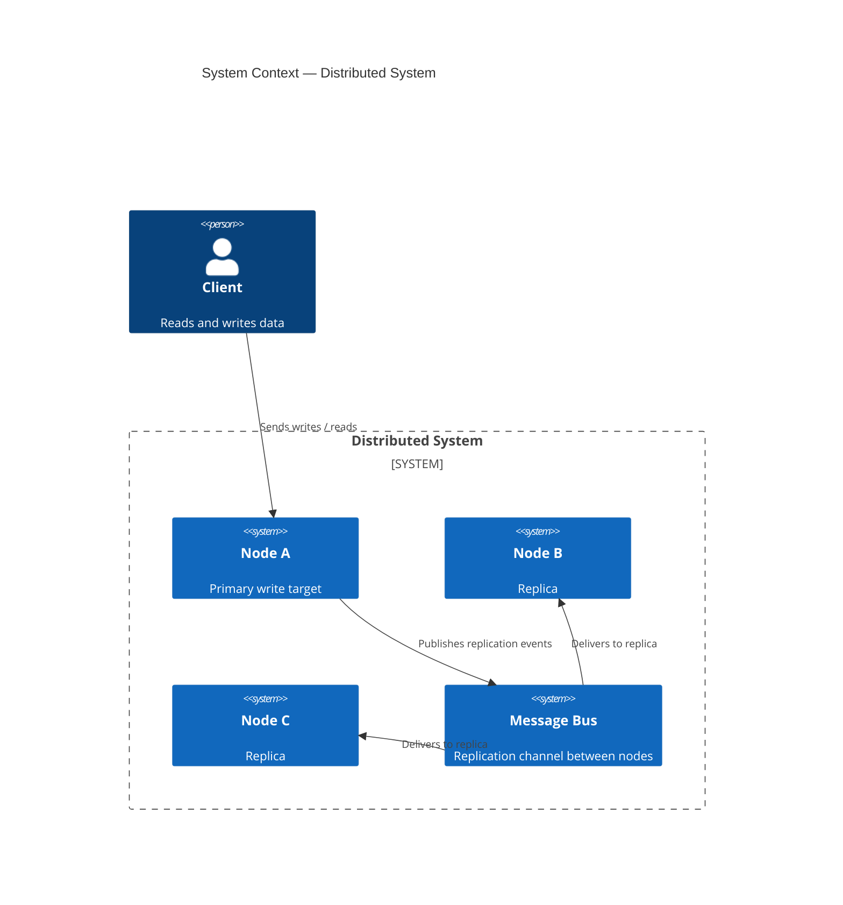
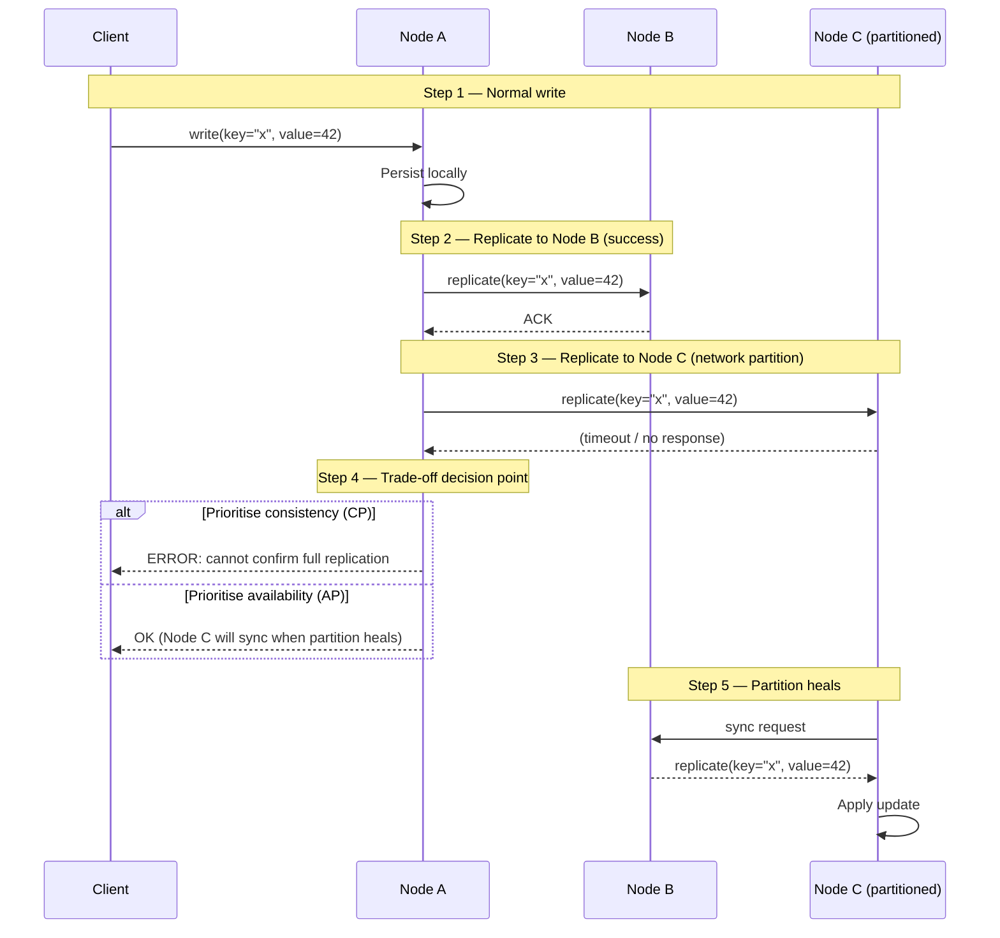

Every distributed system is a negotiation. You're not building a machine that always works — you're deciding, deliberately, how it fails.

## The problem

Engineers coming from single-node backgrounds tend to treat distribution as a deployment detail. You write your service, containerize it, scale it horizontally, and assume the behavior stays the same. It doesn't. Network calls fail silently. Clocks drift. Nodes crash mid-write. The moment you have more than one machine, you have a system that can disagree with itself — and you need a position on what to do when it does.

The dangerous moment isn't a total outage. It's the partial failure: two out of three nodes responding, one node lagging behind by 200 milliseconds, a client that received an acknowledgment before the data was fully replicated. These aren't bugs to fix — they're properties of the environment. The question is whether your design accounts for them.

## What distributed systems are

A distributed system is a collection of autonomous nodes that coordinate to appear as a single coherent system to external clients. The coordination is the hard part. Each node has its own memory, its own clock, and its own view of what "now" means. The network between them is unreliable: messages can be delayed, reordered, or lost entirely.

The mental model that matters: **a distributed system is not a fast single machine. It's a set of independent agents with imperfect communication.** Design decisions that are trivial on a single machine — read your own writes, get a consistent snapshot, know the current time — become coordination problems that carry real cost.

## Diagrams

### System context

### Network partition scenario

## The CAP theorem is misunderstood

Most engineers treat CAP as a menu: pick two. But that framing is too static. The theorem, as Brewer stated and Gilbert and Lynch proved, applies only during a **network partition**. When the network is healthy, you can have both consistency and availability. The partition is the forcing function.

More importantly, "consistency" in CAP means linearizability — a very strong guarantee that every read reflects the most recent write across all nodes. Most systems don't need linearizability. They need something weaker, and there's a spectrum.

**Strong consistency** (linearizability): every read sees the latest write. Requires coordination on every operation. Zookeeper, etcd, and databases running with synchronous replication target this. Cost: latency, availability under partition.

**Causal consistency**: reads see writes they causally depend on. If you wrote a message and then read the thread, you'll see your own message. Operations that aren't causally related can be reordered. MongoDB's causal sessions and some CRDTs operate here.

**Eventual consistency**: given no new writes, all replicas converge to the same value. No guarantee on when. DynamoDB, Cassandra in its default configuration, and DNS operate here. Cost: reads can return stale data; conflicts must be resolved.

The paper that deserves more attention than it gets: Kleppmann's argument that "CP or AP" is a false binary. Real databases expose different consistency levels per operation. A single Cassandra cluster is neither CP nor AP — it depends on the consistency level you request and whether you're in a partition.

## Failure is the spec

The insight that changes how systems get designed: **failure modes are first-class requirements**. If you don't specify them, you'll discover them in production under conditions you didn't anticipate.

Writing the failure doc before the happy-path doc forces better questions. What happens when the primary loses its connection to the replica? Does the client get an error or a stale read? What happens when the client itself crashes after sending a write but before receiving the acknowledgment — does the write replay on reconnect, and is the replay idempotent?

These aren't edge cases. In any system running at scale, they happen continuously. The failure modes are the spec.

A useful exercise: enumerate the ways each external dependency can fail — slow, returning errors, returning wrong data, unreachable, flapping — and write down what your system does in each case. If you can't write it down, you haven't designed it.

## Partition tolerance is not optional

The P in CAP is sometimes discussed as if it's a choice. It isn't, unless your system runs on a single machine. Networks partition. Hardware fails. Switches lose packets. Cloud providers have availability zone outages. The question is not "will we get a partition?" It's "when we get one, what does our system do?"

Treating partition tolerance as optional leads to systems that assume network success and collapse in unexpected ways when it doesn't happen. The better starting position: **assume the network will fail, and design the system so it degrades gracefully**.

Graceful degradation is not the same as returning errors. A read that returns slightly stale data during a partition may be a better outcome than blocking indefinitely. An order system that queues writes locally and replays them when connectivity is restored may be more correct than one that refuses to accept orders during a partition. The right behavior depends on the semantics of your data — but you have to decide, and you have to build the mechanism.

## How real systems handle split-brain

Split-brain is what happens when a partition causes two nodes to believe they're both the authoritative primary. Both accept writes. When the partition heals, you have two divergent histories. Which one wins?

Different systems make different choices:

**Leader election with fencing tokens.** Zookeeper and etcd use Raft to maintain a single leader. A node that loses its lease stops accepting writes. The fencing token is a monotonically increasing number — a node that holds an older token is rejected by the storage layer even if it tries to write. This prevents split-brain at the cost of reduced write availability during leader re-election.

**Last-write-wins (LWW).** Cassandra and DynamoDB default to LWW, using timestamps to resolve conflicts. The problem: clocks drift. A write on a node with a clock running 50ms ahead will silently overwrite a write that happened later in real time. LWW is simple and fast, but it loses data.

**Conflict-free replicated data types (CRDTs).** Operations are designed so that they can be applied in any order and the result is the same. A grow-only counter, a set where removes are tracked with tombstones, a last-write-wins register with vector clocks — all CRDTs. Riak and some operational transforms in collaborative editors use this. The constraint: not all data structures can be expressed as CRDTs. Arbitrary mutations can't.

**Application-level merge.** The system exposes conflicts to the application layer and makes it resolve them. DynamoDB's conditional writes and CouchDB's revision trees work this way. Expensive, but it's the only correct answer when business semantics determine which version wins.

## Designing for failure modes first

The practical implication of taking failure seriously is a specific design order:

1. Define the consistency requirement for each data type. Does this counter need to be exact, or is an approximation acceptable? Does this user-visible record need to be read-your-own-write consistent, or can it lag by a few seconds?

2. Choose a replication strategy that matches. Synchronous replication for strong consistency; asynchronous for availability; quorum reads/writes for a middle ground.

3. Write the conflict resolution strategy before the first write path. Decide upfront whether you're doing LWW, CRDTs, vector clocks, or application-level merge — and build that into the data model from day one. Bolting it on later is expensive.

4. Test partitions before launch. Tools like Jepsen exist to inject partition scenarios and verify that your system's actual behavior matches its documented guarantees. Most systems fail these tests in ways that surprise their authors.

5. Monitor for divergence. In an eventually consistent system, replicas should converge. If they're not converging — if your lag metrics are growing rather than falling — something is wrong with the replication pipeline, and you want to know before a user notices.

## History / adoption timeline

- **1978** — Lamport publishes "Time, Clocks, and the Ordering of Events," establishing logical clocks and happened-before ordering as the foundation for reasoning about distributed state.
- **1987** — The term "two-phase commit" is in widespread use; it becomes the standard protocol for distributed transactions across databases.
- **1998** — Eric Brewer presents the CAP conjecture at PODC. The "pick two" framing enters engineering culture.
- **2002** — Gilbert and Lynch formally prove the CAP theorem.
- **2007** — Amazon's Dynamo paper introduces consistent hashing, vector clocks, and eventual consistency as first-class design tools for a production system at scale.
- **2012** — Kyle Kingsbury begins the Jepsen series, empirically testing distributed databases and finding that most don't meet their advertised guarantees.
- **2014** — The Raft consensus algorithm is published as a more understandable alternative to Paxos, accelerating adoption of strong consensus in new systems.
- **2020s** — CRDTs see commercial adoption in collaborative tools (Figma, Notion, Linear). Consensus-as-a-service becomes infrastructure (etcd in Kubernetes, TiKV in TiDB).

## What makes a good distributed system

1. **Explicit consistency contracts per operation.** The system documents what consistency level each read and write provides, rather than claiming a single level for the whole system.
2. **Idempotent write paths.** Retries are unavoidable. Every write operation should be safe to apply more than once.
3. **Defined conflict resolution.** The system has a documented strategy for handling concurrent conflicting writes, chosen before the first replica is deployed.
4. **Bounded staleness.** In eventually consistent configurations, the system tracks and exposes replication lag so applications can decide whether stale data is acceptable.
5. **Graceful partition behavior.** The system degrades to a documented state during a partition rather than blocking, throwing errors, or producing silent corruption.
6. **Observability of replication health.** Lag, divergence, and leader election events are metrics, not logs buried in noise.

## Where it goes from here

Distributed systems research has shifted toward mixed-consistency models — systems where you choose the consistency level per operation and pay only the coordination cost you need. FoundationDB, CockroachDB, and Spanner demonstrate that strong consistency is achievable at scale when you build the right primitives. The cost is coordination, not correctness.

The next frontier is AI-native workloads: vector stores, embedding pipelines, and model-serving infrastructure that must distribute state across many nodes while remaining coherent enough for the model outputs to be meaningful. The consistency models developed for OLTP systems don't map cleanly onto approximate retrieval. That's an open problem, and the engineering patterns to solve it are still being written.

## Further reading

- [Please stop calling databases CP or AP](https://martin.kleppmann.com/2015/05/11/please-stop-calling-databases-cp-or-ap.html) — Kleppmann argues the CP/AP binary obscures more than it reveals, and that most real databases can't be cleanly categorized.
- [Eventually Consistent](https://www.allthingsdistributed.com/2008/12/eventually_consistent.html) — Werner Vogels' original framing of eventual consistency from the Dynamo experience at Amazon.
- [Jepsen: distributed systems safety research](https://aphyr.com/tags/jepsen) — Kyle Kingsbury's empirical testing of distributed databases under partition. Essential reading before trusting any consistency claim.
- [Time, Clocks, and the Ordering of Events](https://lamport.azurewebsites.net/pubs/time-clocks.pdf) — Lamport's foundational paper on logical clocks and causality ordering in distributed systems.
- [Designs, Lessons and Advice from Building Large Distributed Systems](https://www.cs.cornell.edu/projects/ladis2009/talks/dean-keynote-ladis2009.pdf) — Jeff Dean's LADIS 2009 keynote on the practical realities of operating systems at Google's scale.

---

**Ivens Signorini** is a Senior Backend Engineer focused on distributed systems, AI infrastructure, and high-performance APIs. He works primarily in Go and TypeScript, building systems that run at scale. His technical interests include protocol design, concurrency patterns, and the architecture of AI-native applications. He writes at [signorini.cloud](https://signorini.cloud).
