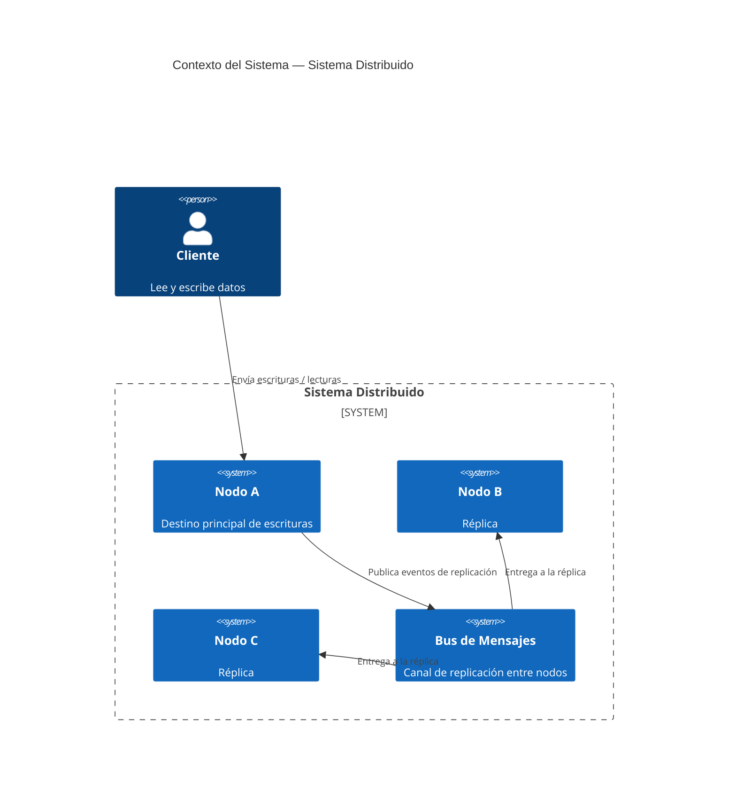
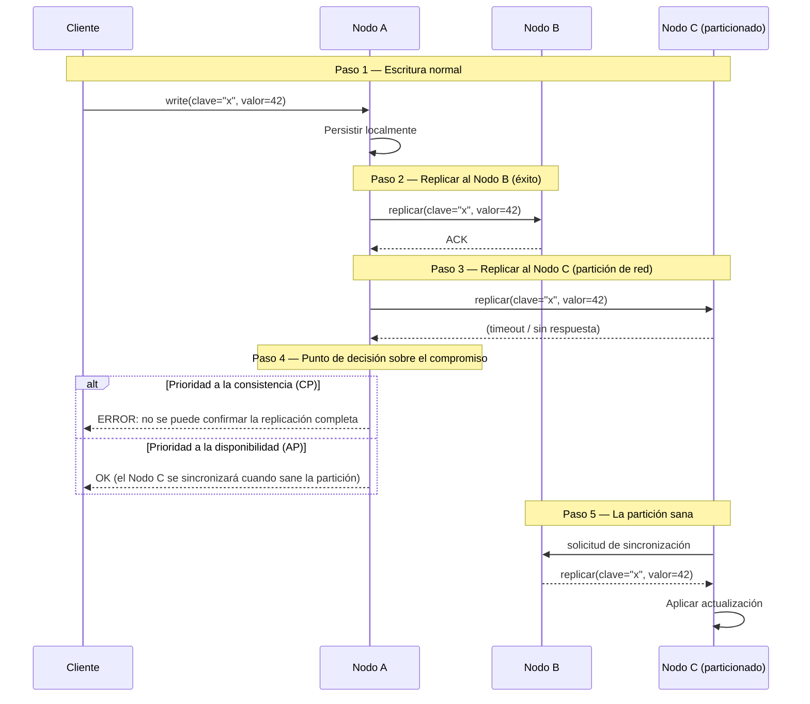

Todo sistema distribuido es una negociación. No se construye una máquina que siempre funciona — se decide, deliberadamente, cómo falla.

## El problema

Los ingenieros que provienen de entornos de nodo único tienden a tratar la distribución como un detalle de despliegue. Se escribe el servicio, se containeriza, se escala horizontalmente, y se asume que el comportamiento se mantiene igual. No es así. Las llamadas de red fallan silenciosamente. Los relojes se desvían. Los nodos se detienen en mitad de una escritura. En el momento en que hay más de una máquina, se tiene un sistema que puede estar en desacuerdo consigo mismo — y se necesita una posición sobre qué hacer cuando ocurre.

El momento peligroso no es una interrupción total. Es el fallo parcial: dos de tres nodos respondiendo, un nodo con 200 milisegundos de retraso, un cliente que recibió un acknowledgment antes de que los datos estuvieran completamente replicados. No son bugs que arreglar — son propiedades del entorno. La pregunta es si el diseño las contempla.

## Qué son los sistemas distribuidos

Un sistema distribuido es un conjunto de nodos autónomos que se coordinan para aparecer como un único sistema coherente ante los clientes externos. La coordinación es la parte difícil. Cada nodo tiene su propia memoria, su propio reloj y su propia visión de qué significa "ahora". La red entre ellos es poco fiable: los mensajes pueden retrasarse, reordenarse o perderse por completo.

El modelo mental que importa: **un sistema distribuido no es una máquina rápida de nodo único. Es un conjunto de agentes independientes con comunicación imperfecta.** Las decisiones de diseño que son triviales en una sola máquina — leer tus propias escrituras, obtener un snapshot consistente, conocer la hora actual — se convierten en problemas de coordinación que tienen un coste real.

## Diagramas

### Contexto del sistema

### Escenario de partición de red

## El teorema CAP está mal entendido

La mayoría de los ingenieros tratan CAP como un menú: elige dos. Pero esa formulación es demasiado estática. El teorema, tal como Brewer lo enunció y Gilbert y Lynch lo demostraron, se aplica solo durante una **partición de red**. Cuando la red está sana, se puede tener tanto consistencia como disponibilidad. La partición es la fuerza desencadenante.

Más importante aún, la "consistencia" en CAP significa linearizabilidad — una garantía muy fuerte de que cada lectura refleja la escritura más reciente en todos los nodos. La mayoría de los sistemas no necesitan linearizabilidad. Necesitan algo más débil, y hay un espectro.

**Consistencia fuerte** (linearizabilidad): cada lectura ve la última escritura. Requiere coordinación en cada operación. Zookeeper, etcd y las bases de datos con replicación síncrona apuntan a esto. Coste: latencia, disponibilidad reducida durante la partición.

**Consistencia causal**: las lecturas ven las escrituras de las que dependen causalmente. Si escribiste un mensaje y luego leíste el hilo, verás tu propio mensaje. Las operaciones que no están causalmente relacionadas pueden reordenarse. Las sesiones causales de MongoDB y algunos CRDTs operan aquí.

**Consistencia eventual**: dadas ninguna escritura nueva, todas las réplicas convergen al mismo valor. Sin garantía de cuándo. DynamoDB, Cassandra en su configuración por defecto y DNS operan aquí. Coste: las lecturas pueden devolver datos obsoletos; los conflictos deben resolverse.

El paper que merece más atención de la que recibe: el argumento de Kleppmann de que "CP o AP" es una falsa dicotomía. Las bases de datos reales exponen diferentes niveles de consistencia por operación. Un único clúster de Cassandra no es ni CP ni AP — depende del nivel de consistencia que se solicite y de si hay una partición.

## El fallo es la especificación

El insight que cambia cómo se diseñan los sistemas: **los modos de fallo son requisitos de primera clase**. Si no se especifican, se descubren en producción bajo condiciones que no se anticiparon.

Escribir el documento de fallos antes que el documento de happy-path fuerza mejores preguntas. ¿Qué ocurre cuando el primario pierde la conexión con la réplica? ¿El cliente recibe un error o una lectura obsoleta? ¿Qué ocurre cuando el propio cliente falla después de enviar una escritura pero antes de recibir el acknowledgment — la escritura se repite al reconectarse, y la repetición es idempotente?

No son casos límite. En cualquier sistema ejecutándose a escala, ocurren continuamente. Los modos de fallo son la especificación.

Un ejercicio útil: enumerar las formas en que cada dependencia externa puede fallar — lenta, devolviendo errores, devolviendo datos incorrectos, inalcanzable, inestable — y escribir qué hace el sistema en cada caso. Si no se puede escribir, no está diseñado.

## La tolerancia a particiones no es opcional

La P en CAP se discute a veces como si fuera una elección. No lo es, a menos que el sistema corra en una sola máquina. Las redes se particionan. El hardware falla. Los switches pierden paquetes. Los proveedores cloud tienen interrupciones de availability zone. La pregunta no es "¿habrá una partición?" Es "cuando haya una partición, ¿qué hace nuestro sistema?"

Tratar la tolerancia a particiones como opcional lleva a sistemas que asumen el éxito de la red y colapsan de formas inesperadas cuando no ocurre. La posición de partida mejor: **asumir que la red fallará, y diseñar el sistema para que se degrade con gracia**.

La degradación gradual no es lo mismo que devolver errores. Una lectura que devuelve datos ligeramente obsoletos durante una partición puede ser un mejor resultado que bloquearse indefinidamente. Un sistema de pedidos que encola escrituras localmente y las repite cuando se restaura la conectividad puede ser más correcto que uno que se niega a aceptar pedidos durante una partición. El comportamiento correcto depende de la semántica de los datos — pero hay que decidir, y hay que construir el mecanismo.

## Cómo los sistemas reales manejan el split-brain

El split-brain es lo que ocurre cuando una partición hace que dos nodos crean que ambos son el primario autoritativo. Ambos aceptan escrituras. Cuando la partición sana, se tienen dos historias divergentes. ¿Cuál gana?

Diferentes sistemas toman decisiones distintas:

**Elección de líder con tokens de fencing.** Zookeeper y etcd usan Raft para mantener un único líder. Un nodo que pierde su lease deja de aceptar escrituras. El token de fencing es un número que aumenta monótonamente — un nodo que tiene un token más antiguo es rechazado por la capa de almacenamiento incluso si intenta escribir. Esto previene el split-brain al coste de disponibilidad de escritura reducida durante la re-elección del líder.

**Last-write-wins (LWW).** Cassandra y DynamoDB usan LWW por defecto, usando timestamps para resolver conflictos. El problema: los relojes se desvían. Una escritura en un nodo con un reloj adelantado 50ms sobreescribirá silenciosamente una escritura que ocurrió más tarde en tiempo real. LWW es simple y rápido, pero pierde datos.

**Conflict-free replicated data types (CRDTs).** Las operaciones están diseñadas para que puedan aplicarse en cualquier orden y el resultado sea el mismo. Un contador de solo crecimiento, un conjunto donde las eliminaciones se rastrean con tombstones, un registro last-write-wins con vector clocks — todos CRDTs. Riak y algunas transformaciones operacionales en editores colaborativos usan esto. La restricción: no todas las estructuras de datos pueden expresarse como CRDTs. Las mutaciones arbitrarias no pueden.

**Merge a nivel de aplicación.** El sistema expone los conflictos a la capa de aplicación y la hace resolverlos. Las escrituras condicionales de DynamoDB y los árboles de revisión de CouchDB funcionan así. Costoso, pero es la única respuesta correcta cuando la semántica de negocio determina qué versión gana.

## Diseñar para los modos de fallo primero

La implicación práctica de tomar el fallo en serio es un orden de diseño específico:

1. Definir el requisito de consistencia para cada tipo de dato. ¿Este contador necesita ser exacto, o es aceptable una aproximación? ¿Este registro visible al usuario necesita ser consistente en modo read-your-own-write, o puede tener unos segundos de retraso?

2. Elegir una estrategia de replicación que corresponda. Replicación síncrona para consistencia fuerte; asíncrona para disponibilidad; lecturas/escrituras con quórum como término medio.

3. Escribir la estrategia de resolución de conflictos antes del primer camino de escritura. Decidir de antemano si se hará LWW, CRDTs, vector clocks o merge a nivel de aplicación — e integrarlo en el modelo de datos desde el primer día. Añadirlo más tarde es costoso.

4. Probar particiones antes del lanzamiento. Herramientas como Jepsen existen para inyectar escenarios de partición y verificar que el comportamiento real del sistema coincide con sus garantías documentadas. La mayoría de los sistemas fallan estas pruebas de formas que sorprenden a sus autores.

5. Monitorizar la divergencia. En un sistema con consistencia eventual, las réplicas deben converger. Si no convergen — si las métricas de lag crecen en lugar de disminuir — algo va mal en la pipeline de replicación, y se quiere saber antes de que un usuario lo note.

## Cronología de adopción

- **1978** — Lamport publica "Time, Clocks, and the Ordering of Events", estableciendo los relojes lógicos y el ordenamiento happened-before como fundamento para razonar sobre el estado distribuido.
- **1987** — El término "two-phase commit" está en uso generalizado; se convierte en el protocolo estándar para transacciones distribuidas entre bases de datos.
- **1998** — Eric Brewer presenta la conjetura CAP en PODC. La formulación "elige dos" entra en la cultura de la ingeniería.
- **2002** — Gilbert y Lynch demuestran formalmente el teorema CAP.
- **2007** — El paper Dynamo de Amazon introduce consistent hashing, vector clocks y consistencia eventual como herramientas de diseño de primera clase para un sistema en producción a escala.
- **2012** — Kyle Kingsbury comienza la serie Jepsen, probando empíricamente bases de datos distribuidas y encontrando que la mayoría no cumple sus garantías anunciadas.
- **2014** — El algoritmo de consenso Raft se publica como alternativa más comprensible a Paxos, acelerando la adopción de consenso fuerte en nuevos sistemas.
- **años 2020** — Los CRDTs ven adopción comercial en herramientas colaborativas (Figma, Notion, Linear). El consenso-como-servicio se convierte en infraestructura (etcd en Kubernetes, TiKV en TiDB).

## Qué hace bueno a un sistema distribuido

1. **Contratos de consistencia explícitos por operación.** El sistema documenta qué nivel de consistencia proporciona cada lectura y escritura, en lugar de declarar un único nivel para todo el sistema.
2. **Caminos de escritura idempotentes.** Los reintentos son inevitables. Cada operación de escritura debe ser segura de aplicar más de una vez.
3. **Resolución de conflictos definida.** El sistema tiene una estrategia documentada para manejar escrituras conflictivas concurrentes, elegida antes de desplegar la primera réplica.
4. **Obsolescencia acotada.** En configuraciones con consistencia eventual, el sistema rastrea y expone el lag de replicación para que las aplicaciones puedan decidir si los datos obsoletos son aceptables.
5. **Comportamiento en partición gradual.** El sistema se degrada a un estado documentado durante una partición en lugar de bloquearse, lanzar errores o producir corrupción silenciosa.
6. **Observabilidad de la salud de la replicación.** Lag, divergencia y eventos de elección de líder son métricas, no logs enterrados en ruido.

## Hacia dónde va desde aquí

La investigación en sistemas distribuidos se ha desplazado hacia modelos de consistencia mixta — sistemas donde se elige el nivel de consistencia por operación y se paga solo el coste de coordinación necesario. FoundationDB, CockroachDB y Spanner demuestran que la consistencia fuerte es alcanzable a escala cuando se construyen las primitivas correctas. El coste es la coordinación, no la corrección.

La próxima frontera son las cargas de trabajo AI-native: vector stores, pipelines de embeddings e infraestructura de model-serving que deben distribuir estado entre muchos nodos manteniéndose suficientemente coherentes para que los outputs del modelo tengan sentido. Los modelos de consistencia desarrollados para sistemas OLTP no se mapean limpiamente sobre el retrieval aproximado. Es un problema abierto, y los patrones de ingeniería para resolverlo aún se están escribiendo.

## Lecturas recomendadas

- [Please stop calling databases CP or AP](https://martin.kleppmann.com/2015/05/11/please-stop-calling-databases-cp-or-ap.html) — Kleppmann argumenta que la dicotomía CP/AP oscurece más de lo que revela, y que la mayoría de las bases de datos reales no pueden categorizarse limpiamente.
- [Eventually Consistent](https://www.allthingsdistributed.com/2008/12/eventually_consistent.html) — La formulación original de Werner Vogels sobre la consistencia eventual desde la experiencia con Dynamo en Amazon.
- [Jepsen: distributed systems safety research](https://aphyr.com/tags/jepsen) — Las pruebas empíricas de Kyle Kingsbury de bases de datos distribuidas bajo partición. Lectura esencial antes de confiar en cualquier afirmación de consistencia.
- [Time, Clocks, and the Ordering of Events](https://lamport.azurewebsites.net/pubs/time-clocks.pdf) — El paper fundamental de Lamport sobre relojes lógicos y ordenamiento causal en sistemas distribuidos.
- [Designs, Lessons and Advice from Building Large Distributed Systems](https://www.cs.cornell.edu/projects/ladis2009/talks/dean-keynote-ladis2009.pdf) — El keynote de Jeff Dean en LADIS 2009 sobre las realidades prácticas de operar sistemas a la escala de Google.

---

**Ivens Signorini** es un Senior Backend Engineer especializado en sistemas distribuidos, infraestructura de IA y APIs de alto rendimiento. Trabaja principalmente en Go y TypeScript, construyendo sistemas que operan a escala. Sus intereses técnicos incluyen el diseño de protocolos, patrones de concurrencia y la arquitectura de aplicaciones nativas de IA. Escribe en [signorini.cloud](https://signorini.cloud).
