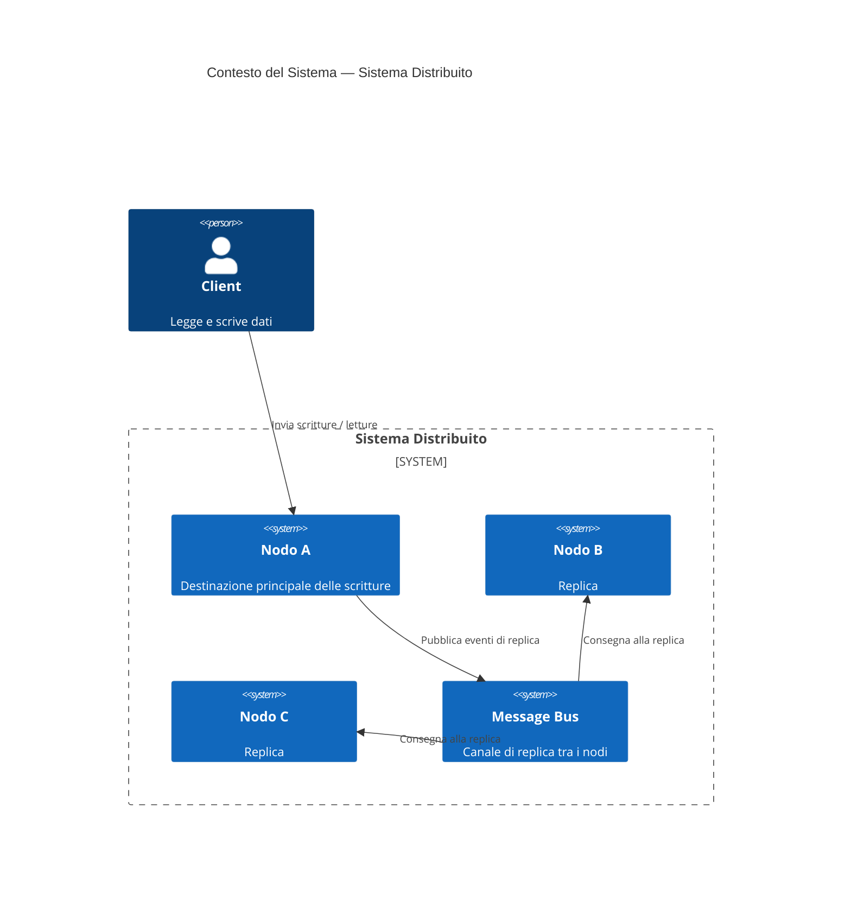
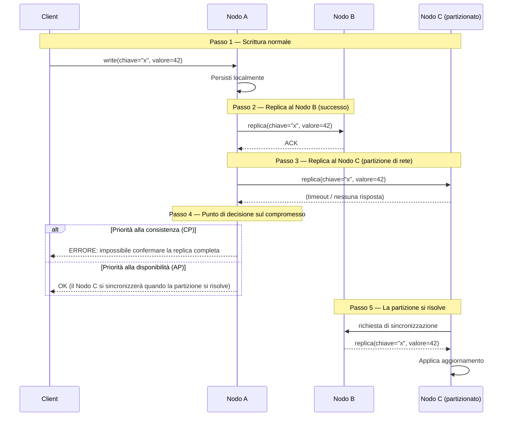

Ogni sistema distribuito è una negoziazione. Non si costruisce una macchina che funziona sempre — si decide, deliberatamente, come fallisce.

## Il problema

Gli ingegneri che provengono da contesti single-node tendono a trattare la distribuzione come un dettaglio di deploy. Si scrive il servizio, lo si containerizza, lo si scala orizzontalmente, e si assume che il comportamento rimanga lo stesso. Non è così. Le chiamate di rete falliscono silenziosamente. Gli orologi deviano. I nodi si arrestano a metà scrittura. Nel momento in cui si hanno più di una macchina, si ha un sistema che può essere in disaccordo con se stesso — e serve una posizione su cosa fare quando accade.

Il momento pericoloso non è un'interruzione totale. È il fallimento parziale: due nodi su tre che rispondono, un nodo in ritardo di 200 millisecondi, un client che ha ricevuto un acknowledgment prima che i dati fossero completamente replicati. Non sono bug da correggere — sono proprietà dell'ambiente. La domanda è se il design le considera.

## Cosa sono i sistemi distribuiti

Un sistema distribuito è un insieme di nodi autonomi che si coordinano per apparire come un unico sistema coerente ai client esterni. Il coordinamento è la parte difficile. Ogni nodo ha la propria memoria, il proprio orologio e la propria visione di cosa significa "adesso". La rete tra loro è inaffidabile: i messaggi possono essere ritardati, riordinati o persi del tutto.

Il modello mentale che conta: **un sistema distribuito non è una macchina singola veloce. È un insieme di agenti indipendenti con comunicazione imperfetta.** Decisioni di design banali su una macchina singola — leggere i propri dati scritti, ottenere uno snapshot consistente, conoscere l'ora corrente — diventano problemi di coordinamento che comportano un costo reale.

## Diagrammi

### Contesto del sistema

### Scenario di partizione di rete

## Il teorema CAP è frainteso

La maggior parte degli ingegneri tratta CAP come un menu: scegline due. Ma quella formulazione è troppo statica. Il teorema, come Brewer l'ha enunciato e Gilbert e Lynch l'hanno dimostrato, si applica solo durante una **partizione di rete**. Quando la rete è integra, è possibile avere sia consistenza che disponibilità. La partizione è la forza scatenante.

Ancor più importante, la "consistenza" nel CAP significa linearizzabilità — una garanzia molto forte che ogni lettura riflette la scrittura più recente su tutti i nodi. La maggior parte dei sistemi non ha bisogno di linearizzabilità. Ha bisogno di qualcosa di più debole, e c'è uno spettro.

**Consistenza forte** (linearizzabilità): ogni lettura vede l'ultima scrittura. Richiede coordinamento su ogni operazione. Zookeeper, etcd e i database con replica sincrona mirano a questo. Costo: latenza, disponibilità ridotta durante la partizione.

**Consistenza causale**: le letture vedono le scritture da cui dipendono causalmente. Se hai scritto un messaggio e poi hai letto il thread, vedrai il tuo messaggio. Le operazioni che non sono causalmente correlate possono essere riordinate. Le sessioni causali di MongoDB e alcuni CRDT operano qui.

**Consistenza eventuale**: dati nessuna nuova scrittura, tutte le repliche convergono allo stesso valore. Nessuna garanzia su quando. DynamoDB, Cassandra nella sua configurazione predefinita e il DNS operano qui. Costo: le letture possono restituire dati obsoleti; i conflitti devono essere risolti.

Il paper che merita più attenzione di quanta ne riceve: l'argomento di Kleppmann secondo cui "CP o AP" è una falsa alternativa. I database reali espongono diversi livelli di consistenza per operazione. Un singolo cluster Cassandra non è né CP né AP — dipende dal livello di consistenza richiesto e dalla presenza di una partizione.

## Il guasto è la specifica

L'insight che cambia il modo in cui i sistemi vengono progettati: **le modalità di guasto sono requisiti di prima classe**. Se non le si specifica, le si scopre in produzione in condizioni impreviste.

Scrivere il documento dei guasti prima del documento happy-path forza domande migliori. Cosa succede quando il primario perde la connessione con la replica? Il client riceve un errore o una lettura obsoleta? Cosa succede quando il client stesso si arresta dopo aver inviato una scrittura ma prima di ricevere l'acknowledgment — la scrittura viene ripetuta alla riconnessione, e la ripetizione è idempotente?

Non sono casi limite. In qualsiasi sistema in esecuzione su larga scala, accadono continuamente. Le modalità di guasto sono la specifica.

Un esercizio utile: enumerare i modi in cui ogni dipendenza esterna può fallire — lenta, che restituisce errori, che restituisce dati errati, irraggiungibile, instabile — e scrivere cosa fa il sistema in ogni caso. Se non si riesce a scriverlo, non è stato progettato.

## La tolleranza alle partizioni non è opzionale

La P nel CAP viene a volte discussa come se fosse una scelta. Non lo è, a meno che il sistema non giri su una singola macchina. Le reti si partizionano. L'hardware fallisce. Gli switch perdono pacchetti. I cloud provider hanno interruzioni delle availability zone. La domanda non è "ci sarà una partizione?" È "quando ci sarà una partizione, cosa fa il nostro sistema?"

Trattare la tolleranza alle partizioni come opzionale porta a sistemi che assumono il successo della rete e collassano in modi imprevisti quando non avviene. La posizione di partenza migliore: **assumere che la rete fallirà, e progettare il sistema in modo che si degradi con grazia**.

La degradazione graduale non è uguale alla restituzione di errori. Una lettura che restituisce dati leggermente obsoleti durante una partizione può essere un risultato migliore che bloccarsi indefinitamente. Un sistema di ordini che accoda le scritture localmente e le riproduce quando la connettività viene ripristinata può essere più corretto di uno che rifiuta di accettare ordini durante una partizione. Il comportamento corretto dipende dalla semantica dei dati — ma bisogna decidere, e bisogna costruire il meccanismo.

## Come i sistemi reali gestiscono lo split-brain

Lo split-brain è ciò che accade quando una partizione fa sì che due nodi credano entrambi di essere il primario autorevole. Entrambi accettano scritture. Quando la partizione si risolve, si hanno due storie divergenti. Chi vince?

Sistemi diversi fanno scelte diverse:

**Elezione del leader con token di fencing.** Zookeeper e etcd usano Raft per mantenere un singolo leader. Un nodo che perde il suo lease smette di accettare scritture. Il token di fencing è un numero che aumenta monotonicamente — un nodo che detiene un token più vecchio viene rifiutato dallo strato di storage anche se tenta di scrivere. Questo previene lo split-brain al costo di una disponibilità ridotta in scrittura durante la rielelezione del leader.

**Last-write-wins (LWW).** Cassandra e DynamoDB usano LWW per default, usando i timestamp per risolvere i conflitti. Il problema: gli orologi deviano. Una scrittura su un nodo con un orologio in anticipo di 50ms sovrascriverà silenziosamente una scrittura che è avvenuta dopo nel tempo reale. LWW è semplice e veloce, ma perde dati.

**Conflict-free replicated data types (CRDT).** Le operazioni sono progettate in modo che possano essere applicate in qualsiasi ordine e il risultato sia lo stesso. Un contatore a sola crescita, un insieme in cui le rimozioni sono tracciate con tombstone, un registro last-write-wins con vector clock — tutti CRDT. Riak e alcune trasformazioni operative negli editor collaborativi usano questo. Il vincolo: non tutte le strutture dati possono essere espresse come CRDT. Le mutazioni arbitrarie non possono esserlo.

**Merge a livello applicativo.** Il sistema espone i conflitti allo strato applicativo e lo fa risolvere. Le scritture condizionali di DynamoDB e gli alberi di revisione di CouchDB funzionano in questo modo. Costoso, ma è l'unica risposta corretta quando la semantica di business determina quale versione vince.

## Progettare per le modalità di guasto prima di tutto

L'implicazione pratica di prendere il guasto sul serio è un ordine di design specifico:

1. Definire il requisito di consistenza per ogni tipo di dato. Questo contatore deve essere esatto, o è accettabile un'approssimazione? Questo record visibile all'utente deve essere consistente in modalità read-your-own-write, o può essere in ritardo di qualche secondo?

2. Scegliere una strategia di replica adeguata. Replica sincrona per la consistenza forte; asincrona per la disponibilità; letture/scritture con quorum per una via di mezzo.

3. Scrivere la strategia di risoluzione dei conflitti prima del primo percorso di scrittura. Decidere in anticipo se si farà LWW, CRDT, vector clock o merge a livello applicativo — e integrarlo nel modello dei dati fin dal primo giorno. Aggiungerlo in un secondo momento è costoso.

4. Testare le partizioni prima del lancio. Strumenti come Jepsen esistono per iniettare scenari di partizione e verificare che il comportamento effettivo del sistema corrisponda alle garanzie documentate. La maggior parte dei sistemi fallisce questi test in modi che sorprendono i loro autori.

5. Monitorare la divergenza. In un sistema con consistenza eventuale, le repliche dovrebbero convergere. Se non convergono — se le metriche di lag crescono anziché diminuire — qualcosa non va nella pipeline di replica, e si vuole saperlo prima che un utente se ne accorga.

## Cronologia adozione

- **1978** — Lamport pubblica "Time, Clocks, and the Ordering of Events", stabilendo gli orologi logici e l'ordinamento happened-before come fondamento del ragionamento sullo stato distribuito.
- **1987** — Il termine "two-phase commit" è di uso comune; diventa il protocollo standard per le transazioni distribuite tra database.
- **1998** — Eric Brewer presenta la congettura CAP a PODC. La formulazione "scegli due" entra nella cultura ingegneristica.
- **2002** — Gilbert e Lynch dimostrano formalmente il teorema CAP.
- **2007** — Il paper Dynamo di Amazon introduce consistent hashing, vector clock e consistenza eventuale come strumenti di design di prima classe per un sistema in produzione su larga scala.
- **2012** — Kyle Kingsbury inizia la serie Jepsen, testando empiricamente i database distribuiti e scoprendo che la maggior parte non soddisfa le garanzie dichiarate.
- **2014** — L'algoritmo di consenso Raft viene pubblicato come alternativa più comprensibile a Paxos, accelerando l'adozione del consenso forte nei nuovi sistemi.
- **anni 2020** — I CRDT vedono adozione commerciale negli strumenti collaborativi (Figma, Notion, Linear). Il consenso-come-servizio diventa infrastruttura (etcd in Kubernetes, TiKV in TiDB).

## Cosa rende buono un sistema distribuito

1. **Contratti di consistenza espliciti per operazione.** Il sistema documenta il livello di consistenza che ogni lettura e scrittura fornisce, piuttosto che dichiarare un unico livello per l'intero sistema.
2. **Percorsi di scrittura idempotenti.** I retry sono inevitabili. Ogni operazione di scrittura deve essere sicura da applicare più volte.
3. **Risoluzione dei conflitti definita.** Il sistema ha una strategia documentata per gestire le scritture conflittuali concorrenti, scelta prima del deploy della prima replica.
4. **Staleness delimitata.** Nelle configurazioni con consistenza eventuale, il sistema traccia ed espone il lag di replica in modo che le applicazioni possano decidere se i dati obsoleti sono accettabili.
5. **Comportamento in partizione graduale.** Il sistema si degrada a uno stato documentato durante una partizione piuttosto che bloccarsi, generare errori o produrre corruzione silenziosa.
6. **Osservabilità della salute della replica.** Lag, divergenza ed eventi di elezione del leader sono metriche, non log sepolti nel rumore.

## Dove va da qui

La ricerca sui sistemi distribuiti si è spostata verso modelli di consistenza mista — sistemi in cui si sceglie il livello di consistenza per operazione e si paga solo il costo di coordinamento necessario. FoundationDB, CockroachDB e Spanner dimostrano che la consistenza forte è raggiungibile su larga scala quando si costruiscono le giuste primitive. Il costo è il coordinamento, non la correttezza.

La prossima frontiera sono i carichi di lavoro AI-native: vector store, pipeline di embedding e infrastruttura di model-serving che devono distribuire lo stato su molti nodi rimanendo sufficientemente coerenti perché gli output del modello abbiano senso. I modelli di consistenza sviluppati per i sistemi OLTP non si mappano in modo pulito sul retrieval approssimativo. È un problema aperto, e i pattern ingegneristici per risolverlo sono ancora in fase di scrittura.

## Letture consigliate

- [Please stop calling databases CP or AP](https://martin.kleppmann.com/2015/05/11/please-stop-calling-databases-cp-or-ap.html) — Kleppmann sostiene che la binarietà CP/AP oscura più di quanto riveli, e che la maggior parte dei database reali non può essere categorizzata in modo netto.
- [Eventually Consistent](https://www.allthingsdistributed.com/2008/12/eventually_consistent.html) — La formulazione originale della consistenza eventuale di Werner Vogels dall'esperienza con Dynamo in Amazon.
- [Jepsen: distributed systems safety research](https://aphyr.com/tags/jepsen) — Il testing empirico di Kyle Kingsbury dei database distribuiti sotto partizione. Lettura essenziale prima di fidarsi di qualsiasi dichiarazione di consistenza.
- [Time, Clocks, and the Ordering of Events](https://lamport.azurewebsites.net/pubs/time-clocks.pdf) — Il paper fondamentale di Lamport sugli orologi logici e l'ordinamento causale nei sistemi distribuiti.
- [Designs, Lessons and Advice from Building Large Distributed Systems](https://www.cs.cornell.edu/projects/ladis2009/talks/dean-keynote-ladis2009.pdf) — Il keynote di Jeff Dean al LADIS 2009 sulle realtà pratiche dell'operare sistemi alla scala di Google.

---

**Ivens Signorini** è un Senior Backend Engineer specializzato in sistemi distribuiti, infrastruttura AI e API ad alte prestazioni. Lavora principalmente in Go e TypeScript, costruendo sistemi che operano su larga scala. I suoi interessi tecnici includono il design dei protocolli, i pattern di concorrenza e l'architettura delle applicazioni AI-native. Scrive su [signorini.cloud](https://signorini.cloud).
