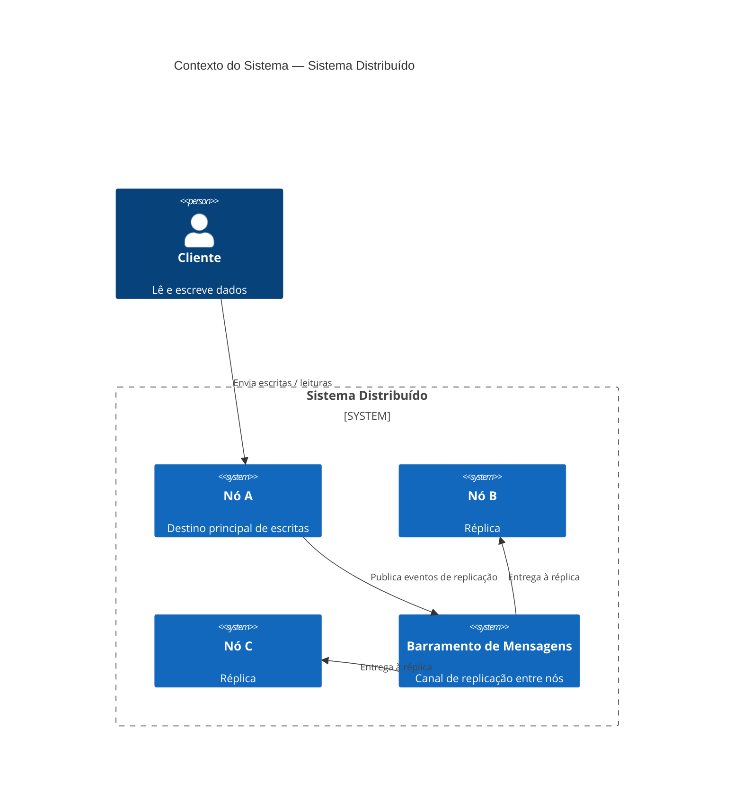
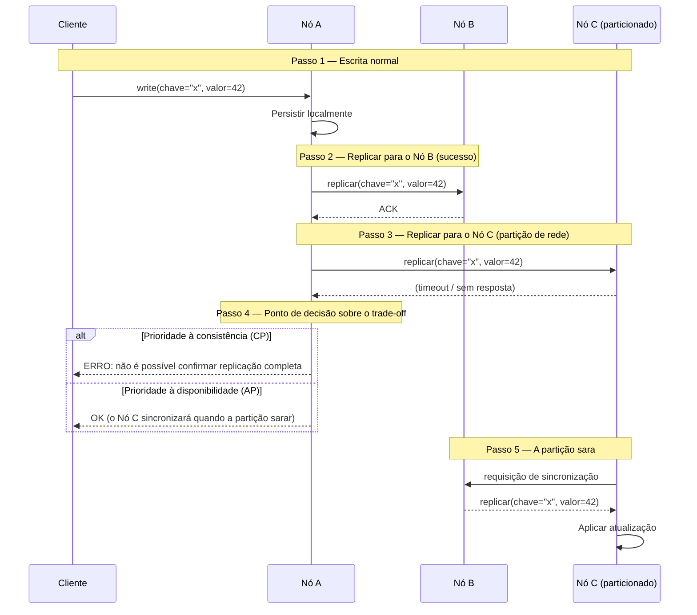

Todo sistema distribuído é uma negociação. Você não está construindo uma máquina que sempre funciona — você está decidindo, deliberadamente, como ela falha.

## O problema

Engenheiros vindos de ambientes de nó único tendem a tratar a distribuição como um detalhe de deployment. Você escreve o serviço, containeriza, escala horizontalmente e assume que o comportamento permanece o mesmo. Não permanece. Chamadas de rede falham silenciosamente. Relógios derivam. Nós travam no meio de uma escrita. No momento em que você tem mais de uma máquina, você tem um sistema que pode discordar consigo mesmo — e você precisa de uma posição sobre o que fazer quando isso acontece.

O momento perigoso não é uma interrupção total. É a falha parcial: dois de três nós respondendo, um nó atrasado 200 milissegundos, um cliente que recebeu um acknowledgment antes de os dados estarem completamente replicados. Esses não são bugs a corrigir — são propriedades do ambiente. A questão é se o design os contempla.

## O que são sistemas distribuídos

Um sistema distribuído é um conjunto de nós autônomos que se coordenam para aparecer como um único sistema coerente para clientes externos. A coordenação é a parte difícil. Cada nó tem sua própria memória, seu próprio relógio e sua própria visão do que "agora" significa. A rede entre eles é não confiável: mensagens podem ser atrasadas, reordenadas ou perdidas completamente.

O modelo mental que importa: **um sistema distribuído não é uma máquina de nó único rápida. É um conjunto de agentes independentes com comunicação imperfeita.** Decisões de design triviais em uma única máquina — ler suas próprias escritas, obter um snapshot consistente, saber a hora atual — tornam-se problemas de coordenação que têm custo real.

## Diagramas

### Contexto do sistema

### Cenário de partição de rede

## O teorema CAP é mal compreendido

A maioria dos engenheiros trata CAP como um menu: escolha dois. Mas essa formulação é estática demais. O teorema, como Brewer enunciou e Gilbert e Lynch provaram, aplica-se apenas durante uma **partição de rede**. Quando a rede está saudável, é possível ter tanto consistência quanto disponibilidade. A partição é a força desencadeadora.

Mais importante ainda, "consistência" no CAP significa linearizabilidade — uma garantia muito forte de que cada leitura reflete a escrita mais recente em todos os nós. A maioria dos sistemas não precisa de linearizabilidade. Precisa de algo mais fraco, e há um espectro.

**Consistência forte** (linearizabilidade): cada leitura vê a última escrita. Requer coordenação em cada operação. Zookeeper, etcd e bancos de dados rodando com replicação síncrona miram isso. Custo: latência, disponibilidade reduzida durante a partição.

**Consistência causal**: leituras veem escritas das quais dependem causalmente. Se você escreveu uma mensagem e depois leu a thread, verá sua própria mensagem. Operações que não estão causalmente relacionadas podem ser reordenadas. As sessões causais do MongoDB e alguns CRDTs operam aqui.

**Consistência eventual**: dadas nenhuma nova escrita, todas as réplicas convergem para o mesmo valor. Sem garantia de quando. DynamoDB, Cassandra na sua configuração padrão e DNS operam aqui. Custo: leituras podem retornar dados obsoletos; conflitos devem ser resolvidos.

O paper que merece mais atenção do que recebe: o argumento de Kleppmann de que "CP ou AP" é uma falsa dicotomia. Bancos de dados reais expõem diferentes níveis de consistência por operação. Um único cluster Cassandra não é nem CP nem AP — depende do nível de consistência solicitado e se há uma partição.

## A falha é a especificação

O insight que muda como os sistemas são projetados: **modos de falha são requisitos de primeira classe**. Se você não os especifica, os descobre em produção sob condições não antecipadas.

Escrever o documento de falhas antes do documento de happy-path força perguntas melhores. O que acontece quando o primário perde a conexão com a réplica? O cliente recebe um erro ou uma leitura obsoleta? O que acontece quando o próprio cliente trava após enviar uma escrita mas antes de receber o acknowledgment — a escrita é repetida na reconexão, e a repetição é idempotente?

Esses não são casos extremos. Em qualquer sistema rodando em escala, eles acontecem continuamente. Os modos de falha são a especificação.

Um exercício útil: enumerar as formas como cada dependência externa pode falhar — lenta, retornando erros, retornando dados incorretos, inacessível, instável — e escrever o que o sistema faz em cada caso. Se você não consegue escrever, não foi projetado.

## Tolerância a partições não é opcional

O P no CAP às vezes é discutido como se fosse uma escolha. Não é, a menos que seu sistema rode em uma única máquina. Redes se particionam. Hardware falha. Switches perdem pacotes. Provedores cloud têm interrupções de availability zone. A questão não é "haverá uma partição?" É "quando houver uma partição, o que nosso sistema faz?"

Tratar tolerância a partições como opcional leva a sistemas que assumem o sucesso da rede e colapsam de formas inesperadas quando ele não acontece. A posição de partida melhor: **assumir que a rede vai falhar, e projetar o sistema para que se degrade graciosamente**.

Degradação graciosa não é o mesmo que retornar erros. Uma leitura que retorna dados ligeiramente obsoletos durante uma partição pode ser um resultado melhor do que bloquear indefinidamente. Um sistema de pedidos que enfileira escritas localmente e as repete quando a conectividade é restaurada pode ser mais correto do que um que se recusa a aceitar pedidos durante uma partição. O comportamento correto depende da semântica dos dados — mas você precisa decidir, e precisa construir o mecanismo.

## Como sistemas reais lidam com split-brain

Split-brain é o que acontece quando uma partição faz com que dois nós acreditem que ambos são o primário autoritativo. Ambos aceitam escritas. Quando a partição sara, você tem duas histórias divergentes. Qual vence?

Sistemas diferentes fazem escolhas diferentes:

**Eleição de líder com tokens de fencing.** Zookeeper e etcd usam Raft para manter um único líder. Um nó que perde seu lease para de aceitar escritas. O token de fencing é um número que cresce monotonicamente — um nó que detém um token mais antigo é rejeitado pela camada de armazenamento mesmo que tente escrever. Isso previne split-brain ao custo de disponibilidade de escrita reduzida durante a reeleição do líder.

**Last-write-wins (LWW).** Cassandra e DynamoDB usam LWW por padrão, usando timestamps para resolver conflitos. O problema: relógios derivam. Uma escrita em um nó com um relógio adiantado 50ms sobreescreverá silenciosamente uma escrita que aconteceu depois no tempo real. LWW é simples e rápido, mas perde dados.

**Conflict-free replicated data types (CRDTs).** Operações são projetadas de forma que possam ser aplicadas em qualquer ordem e o resultado seja o mesmo. Um contador de crescimento apenas, um conjunto onde remoções são rastreadas com tombstones, um registrador last-write-wins com vector clocks — todos CRDTs. Riak e algumas transformações operacionais em editores colaborativos usam isso. A restrição: nem todas as estruturas de dados podem ser expressas como CRDTs. Mutações arbitrárias não podem.

**Merge no nível da aplicação.** O sistema expõe conflitos para a camada de aplicação e a faz resolvê-los. As escritas condicionais do DynamoDB e as árvores de revisão do CouchDB funcionam assim. Caro, mas é a única resposta correta quando a semântica de negócio determina qual versão vence.

## Projetar para modos de falha primeiro

A implicação prática de levar a falha a sério é uma ordem de design específica:

1. Definir o requisito de consistência para cada tipo de dado. Este contador precisa ser exato, ou uma aproximação é aceitável? Este registro visível ao usuário precisa ser consistente no modo read-your-own-write, ou pode ter alguns segundos de atraso?

2. Escolher uma estratégia de replicação que corresponda. Replicação síncrona para consistência forte; assíncrona para disponibilidade; leituras/escritas com quorum como meio-termo.

3. Escrever a estratégia de resolução de conflitos antes do primeiro caminho de escrita. Decidir antecipadamente se fará LWW, CRDTs, vector clocks ou merge no nível da aplicação — e integrá-lo no modelo de dados desde o primeiro dia. Adicioná-lo depois é caro.

4. Testar partições antes do lançamento. Ferramentas como Jepsen existem para injetar cenários de partição e verificar que o comportamento real do sistema corresponde às suas garantias documentadas. A maioria dos sistemas falha nesses testes de formas que surpreendem seus autores.

5. Monitorar divergência. Em um sistema com consistência eventual, réplicas devem convergir. Se não estão convergindo — se suas métricas de lag estão crescendo em vez de diminuindo — algo está errado com o pipeline de replicação, e você quer saber antes que um usuário perceba.

## Cronologia de adoção

- **1978** — Lamport publica "Time, Clocks, and the Ordering of Events", estabelecendo relógios lógicos e ordenamento happened-before como fundação para raciocinar sobre estado distribuído.
- **1987** — O termo "two-phase commit" está em uso generalizado; torna-se o protocolo padrão para transações distribuídas entre bancos de dados.
- **1998** — Eric Brewer apresenta a conjectura CAP no PODC. A formulação "escolha dois" entra na cultura de engenharia.
- **2002** — Gilbert e Lynch provam formalmente o teorema CAP.
- **2007** — O paper Dynamo da Amazon introduz consistent hashing, vector clocks e consistência eventual como ferramentas de design de primeira classe para um sistema em produção em escala.
- **2012** — Kyle Kingsbury inicia a série Jepsen, testando empiricamente bancos de dados distribuídos e descobrindo que a maioria não cumpre suas garantias anunciadas.
- **2014** — O algoritmo de consenso Raft é publicado como alternativa mais compreensível ao Paxos, acelerando a adoção de consenso forte em novos sistemas.
- **anos 2020** — CRDTs veem adoção comercial em ferramentas colaborativas (Figma, Notion, Linear). Consenso-como-serviço torna-se infraestrutura (etcd no Kubernetes, TiKV no TiDB).

## O que faz um bom sistema distribuído

1. **Contratos de consistência explícitos por operação.** O sistema documenta qual nível de consistência cada leitura e escrita fornece, em vez de declarar um único nível para o sistema inteiro.
2. **Caminhos de escrita idempotentes.** Retentativas são inevitáveis. Cada operação de escrita deve ser segura de aplicar mais de uma vez.
3. **Resolução de conflitos definida.** O sistema tem uma estratégia documentada para lidar com escritas conflitantes concorrentes, escolhida antes de implantar a primeira réplica.
4. **Obsolescência limitada.** Em configurações com consistência eventual, o sistema rastreia e expõe o lag de replicação para que aplicações possam decidir se dados obsoletos são aceitáveis.
5. **Comportamento em partição gracioso.** O sistema degrada para um estado documentado durante uma partição em vez de bloquear, lançar erros ou produzir corrupção silenciosa.
6. **Observabilidade da saúde da replicação.** Lag, divergência e eventos de eleição de líder são métricas, não logs enterrados em ruído.

## Para onde vai daqui

A pesquisa em sistemas distribuídos se deslocou em direção a modelos de consistência mista — sistemas onde você escolhe o nível de consistência por operação e paga apenas o custo de coordenação que precisa. FoundationDB, CockroachDB e Spanner demonstram que consistência forte é alcançável em escala quando se constroem as primitivas certas. O custo é a coordenação, não a correção.

A próxima fronteira são as cargas de trabalho AI-native: vector stores, pipelines de embeddings e infraestrutura de model-serving que precisam distribuir estado entre muitos nós permanecendo coerentes o suficiente para que os outputs do modelo façam sentido. Os modelos de consistência desenvolvidos para sistemas OLTP não se mapeiam limpos sobre o retrieval aproximado. É um problema em aberto, e os padrões de engenharia para resolvê-lo ainda estão sendo escritos.

## Leituras recomendadas

- [Please stop calling databases CP or AP](https://martin.kleppmann.com/2015/05/11/please-stop-calling-databases-cp-or-ap.html) — Kleppmann argumenta que a dicotomia CP/AP obscurece mais do que revela, e que a maioria dos bancos de dados reais não pode ser categorizada de forma limpa.
- [Eventually Consistent](https://www.allthingsdistributed.com/2008/12/eventually_consistent.html) — A formulação original de Werner Vogels sobre consistência eventual a partir da experiência com o Dynamo na Amazon.
- [Jepsen: distributed systems safety research](https://aphyr.com/tags/jepsen) — Os testes empíricos de Kyle Kingsbury de bancos de dados distribuídos sob partição. Leitura essencial antes de confiar em qualquer afirmação de consistência.
- [Time, Clocks, and the Ordering of Events](https://lamport.azurewebsites.net/pubs/time-clocks.pdf) — O paper fundamental de Lamport sobre relógios lógicos e ordenamento causal em sistemas distribuídos.
- [Designs, Lessons and Advice from Building Large Distributed Systems](https://www.cs.cornell.edu/projects/ladis2009/talks/dean-keynote-ladis2009.pdf) — O keynote de Jeff Dean no LADIS 2009 sobre as realidades práticas de operar sistemas na escala do Google.

---

**Ivens Signorini** é um Engenheiro Backend Sênior com foco em sistemas distribuídos, infraestrutura de IA e APIs de alto desempenho. Trabalha principalmente em Go e TypeScript, construindo sistemas que operam em escala. Seus interesses técnicos incluem design de protocolos, padrões de concorrência e arquitetura de aplicações nativas de IA. Escreve em [signorini.cloud](https://signorini.cloud).
